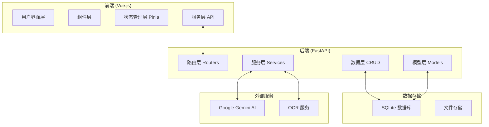

# TaskWall 项目开发指南

## 📋 项目概述

TaskWall 是一个现代化的任务管理系统，采用前后端分离架构，支持可视化任务管理、AI 辅助功能和实时协作。本文档定义了项目的技术栈、架构规范和开发规则，确保团队协作的一致性和代码质量。

## 🏗️ 技术栈

### 前端技术栈

| 技术 | 版本 | 用途 | 备注 |
|------|------|------|------|
| **Vue.js** | 3.x | 核心框架 | 使用 Composition API |
| **TypeScript** | 5.x | 类型系统 | 严格模式开启 |
| **Vite** | 4.x | 构建工具 | 开发和生产构建 |
| **Pinia** | 2.x | 状态管理 | 替代 Vuex |
| **Vue Router** | 4.x | 路由管理 | 历史模式 |
| **Element Plus** | 2.x | UI 组件库 | 主要 UI 框架 |
| **D3.js** | 7.x | 数据可视化 | 画布渲染 |
| **Axios** | 1.x | HTTP 客户端 | API 请求 |
| **Lodash** | 4.x | 工具函数库 | 防抖、节流等 |

### 后端技术栈

| 技术 | 版本 | 用途 | 备注 |
|------|------|------|------|
| **FastAPI** | 0.104+ | Web 框架 | 异步 API 框架 |
| **Python** | 3.9+ | 编程语言 | 类型提示支持 |
| **SQLModel** | 0.0.8+ | ORM 框架 | 基于 SQLAlchemy |
| **SQLite** | 3.x | 数据库 | 开发和小规模部署 |
| **Pydantic** | 2.x | 数据验证 | 模型验证和序列化 |
| **Uvicorn** | 0.23+ | ASGI 服务器 | 生产环境服务器 |
| **Google Gemini** | 1.5 | AI 服务 | 智能功能支持 |
| **Pillow** | 10.x | 图像处理 | OCR 和图片处理 |
| **APScheduler** | 3.x | 任务调度 | 自动备份调度 |

### 开发工具

| 工具 | 用途 | 配置文件 |
|------|------|----------|
| **ESLint** | 前端代码检查 | `.eslintrc.js` |
| **Prettier** | 代码格式化 | `.prettierrc` |
| **Black** | Python 代码格式化 | `pyproject.toml` |
| **MyPy** | Python 类型检查 | `mypy.ini` |
| **Pytest** | 后端测试框架 | `pytest.ini` |
| **Vitest** | 前端测试框架 | `vitest.config.ts` |

## 🏛️ 项目架构

### 整体架构图



### 前端架构

#### 目录结构
```
frontend/
├── src/
│   ├── components/          # 组件目录
│   │   ├── canvas/         # 画布相关组件
│   │   ├── dialogs/        # 对话框组件
│   │   ├── task/           # 任务相关组件
│   │   └── common/         # 通用组件
│   ├── composables/        # 组合式函数
│   │   ├── dialogs/        # 对话框逻辑
│   │   └── *.ts           # 各功能模块逻辑
│   ├── stores/             # Pinia 状态管理
│   ├── services/           # API 服务
│   ├── types/              # TypeScript 类型定义
│   ├── utils/              # 工具函数
│   └── views/              # 页面组件
├── public/                 # 静态资源
└── tests/                  # 测试文件
```

#### 组件分层规则

1. **页面组件 (Views)**
   - 路由级别的组件
   - 负责整体布局和数据协调
   - 文件命名：`PascalCase.vue`

2. **业务组件 (Components)**
   - 可复用的业务逻辑组件
   - 按功能模块分组存放
   - 文件命名：`PascalCase.vue`

3. **基础组件 (Common)**
   - 无业务逻辑的通用组件
   - 高度可复用
   - 以 `Base` 或 `App` 前缀命名

#### 状态管理规则

```typescript
// Store 结构示例
export const useTaskStore = defineStore('tasks', () => {
  // 状态
  const tasks = ref<Task[]>([])
  
  // 计算属性
  const completedTasks = computed(() => 
    tasks.value.filter(task => task.status === 'done')
  )
  
  // 动作
  const addTask = (task: Task) => {
    tasks.value.push(task)
  }
  
  return { tasks, completedTasks, addTask }
})
```

### 后端架构

#### 目录结构
```
backend/
├── app/
│   ├── routers/            # 路由模块
│   │   ├── tasks.py       # 任务管理路由
│   │   ├── ai_v3.py       # AI 功能路由
│   │   └── *.py           # 其他功能路由
│   ├── models/             # 数据模型
│   ├── schemas/            # Pydantic 模型
│   ├── crud/               # 数据库操作
│   ├── services/           # 业务逻辑服务
│   ├── utils/              # 工具函数
│   ├── ai/                 # AI 功能模块
│   ├── deps.py             # 依赖注入
│   └── main.py             # 应用入口
├── data/                   # 数据文件
├── tests/                  # 测试文件
└── requirements.txt        # Python 依赖
```

#### 分层架构规则

1. **路由层 (Routers)**
   - 处理 HTTP 请求和响应
   - 参数验证和权限检查
   - 调用服务层处理业务逻辑

2. **服务层 (Services)**
   - 封装复杂的业务逻辑
   - 协调多个 CRUD 操作
   - 处理事务和异常

3. **数据访问层 (CRUD)**
   - 数据库操作的封装
   - 基础的 CRUD 操作
   - 查询优化

4. **模型层 (Models)**
   - 数据库模型定义
   - 业务规则约束
   - 关系定义

## 📝 开发规范

### 代码规范

#### 前端代码规范

1. **文件命名**
   - 组件：`PascalCase.vue`
   - 工具函数：`camelCase.ts`
   - 常量：`UPPER_SNAKE_CASE.ts`
   - 类型定义：`PascalCase.types.ts`

2. **变量命名**
   ```typescript
   // ✅ 好的命名
   const userTaskList = ref<Task[]>([])
   const isTaskCompleted = computed(() => task.value.status === 'done')
   
   // ❌ 避免的命名
   const list = ref([])
   const flag = ref(false)
   ```

3. **组件规范**
   ```vue
   <template>
     <!-- 使用语义化的 HTML 结构 -->
     <section class="task-list">
       <header class="task-list__header">
         <h2>任务列表</h2>
       </header>
       <main class="task-list__content">
         <!-- 内容 -->
       </main>
     </section>
   </template>
   
   <script setup lang="ts">
   // 1. 导入第三方库
   import { ref, computed, onMounted } from 'vue'
   import { useRouter } from 'vue-router'
   
   // 2. 导入本地模块
   import { useTaskStore } from '@/stores/tasks'
   import type { Task } from '@/types/task'
   
   // 3. 定义 Props 和 Emits
   interface Props {
     tasks: Task[]
     readonly?: boolean
   }
   
   const props = withDefaults(defineProps<Props>(), {
     readonly: false
   })
   
   const emit = defineEmits<{
     taskSelected: [task: Task]
     taskUpdated: [task: Task]
   }>()
   
   // 4. 组合式函数
   const taskStore = useTaskStore()
   const router = useRouter()
   
   // 5. 响应式数据
   const selectedTask = ref<Task | null>(null)
   
   // 6. 计算属性
   const filteredTasks = computed(() => 
     props.tasks.filter(task => !task.archived)
   )
   
   // 7. 方法定义
   const handleTaskSelect = (task: Task) => {
     selectedTask.value = task
     emit('taskSelected', task)
   }
   
   // 8. 生命周期
   onMounted(() => {
     // 初始化逻辑
   })
   </script>
   
   <style scoped>
   .task-list {
     /* 使用 BEM 命名规范 */
   }
   
   .task-list__header {
     /* 组件内部样式 */
   }
   </style>
   ```

#### 后端代码规范

1. **文件命名**
   - 模块：`snake_case.py`
   - 类：`PascalCase`
   - 函数：`snake_case`
   - 常量：`UPPER_SNAKE_CASE`

2. **路由规范**
   ```python
   from fastapi import APIRouter, Depends, HTTPException
   from sqlmodel import Session
   from typing import List
   
   from ..deps import get_db
   from ..models import Task
   from ..crud import TaskCRUD
   from ..schemas import TaskCreate, TaskRead, TaskUpdate
   
   router = APIRouter(prefix="/tasks", tags=["tasks"])
   
   @router.post("/", response_model=TaskRead)
   async def create_task(
       task_in: TaskCreate, 
       db: Session = Depends(get_db)
   ) -> Task:
       """
       创建新任务
       
       Args:
           task_in: 任务创建数据
           db: 数据库会话
           
       Returns:
           创建的任务对象
           
       Raises:
           HTTPException: 创建失败时抛出
       """
       try:
           task = Task(**task_in.dict())
           return TaskCRUD.create(db, task)
       except Exception as e:
           raise HTTPException(
               status_code=400, 
               detail=f"创建任务失败: {str(e)}"
           )
   ```

3. **模型规范**
   ```python
   from sqlmodel import SQLModel, Field, Relationship
   from typing import Optional, List
   from datetime import datetime
   from enum import Enum
   
   class TaskStatus(str, Enum):
       TODO = "todo"
       IN_PROGRESS = "in_progress"
       DONE = "done"
       ARCHIVED = "archived"
   
   class TaskBase(SQLModel):
       """任务基础模型"""
       title: str = Field(max_length=200, description="任务标题")
       description: Optional[str] = Field(default=None, description="任务描述")
       status: TaskStatus = Field(default=TaskStatus.TODO, description="任务状态")
       priority: int = Field(default=2, ge=0, le=4, description="优先级 0-4")
       
   class Task(TaskBase, table=True):
       """任务数据库模型"""
       id: Optional[int] = Field(default=None, primary_key=True)
       created_at: datetime = Field(default_factory=datetime.now)
       updated_at: Optional[datetime] = Field(default=None)
       
       # 关系定义
       dependencies: List["TaskDependency"] = Relationship(
           back_populates="from_task"
       )
   
   class TaskCreate(TaskBase):
       """任务创建模型"""
       pass
   
   class TaskRead(TaskBase):
       """任务读取模型"""
       id: int
       created_at: datetime
       updated_at: Optional[datetime]
   
   class TaskUpdate(SQLModel):
       """任务更新模型"""
       title: Optional[str] = None
       description: Optional[str] = None
       status: Optional[TaskStatus] = None
       priority: Optional[int] = None
   ```

### 组件开发规范

#### 组件拆分原则

1. **单一职责原则**
   - 每个组件只负责一个功能
   - 组件大小控制在 300-400 行以内
   - 超过限制时考虑拆分

2. **可复用性原则**
   - 组件应该是可配置和可复用的
   - 避免硬编码业务逻辑
   - 通过 props 和 slots 提供灵活性

3. **性能优化原则**
   - 合理使用 `v-memo` 和 `v-once`
   - 大列表使用虚拟化
   - 避免不必要的响应式数据

#### 组件通信规范

1. **父子通信**
   ```typescript
   // 父组件传递数据给子组件
   const parentData = ref('parent value')
   
   // 子组件接收数据
   interface Props {
     data: string
   }
   const props = defineProps<Props>()
   
   // 子组件向父组件发送事件
   const emit = defineEmits<{
     update: [value: string]
     delete: [id: number]
   }>()
   
   const handleUpdate = () => {
     emit('update', 'new value')
   }
   ```

2. **跨组件通信**
   ```typescript
   // 使用 Pinia Store
   const store = useTaskStore()
   
   // 或使用 provide/inject
   provide('taskService', taskService)
   const taskService = inject('taskService')
   ```

### API 设计规范

#### RESTful API 规范

1. **URL 设计**
   ```
   GET    /tasks              # 获取任务列表
   POST   /tasks              # 创建新任务
   GET    /tasks/{id}         # 获取特定任务
   PUT    /tasks/{id}         # 完整更新任务
   PATCH  /tasks/{id}         # 部分更新任务
   DELETE /tasks/{id}         # 删除任务
   
   GET    /tasks/{id}/history # 获取任务历史
   POST   /tasks/{id}/comments # 添加任务评论
   ```

2. **响应格式**
   ```json
   {
     "success": true,
     "data": {
       "id": 1,
       "title": "任务标题",
       "status": "todo"
     },
     "message": "操作成功",
     "timestamp": "2024-01-01T00:00:00Z"
   }
   ```

3. **错误处理**
   ```json
   {
     "success": false,
     "error": {
       "code": "TASK_NOT_FOUND",
       "message": "任务不存在",
       "details": "ID 为 123 的任务未找到"
     },
     "timestamp": "2024-01-01T00:00:00Z"
   }
   ```

### 测试规范

#### 前端测试

1. **单元测试**
   ```typescript
   import { describe, it, expect } from 'vitest'
   import { mount } from '@vue/test-utils'
   import TaskCard from '@/components/TaskCard.vue'
   
   describe('TaskCard', () => {
     it('应该正确显示任务信息', () => {
       const task = {
         id: 1,
         title: '测试任务',
         status: 'todo'
       }
       
       const wrapper = mount(TaskCard, {
         props: { task }
       })
       
       expect(wrapper.text()).toContain('测试任务')
       expect(wrapper.find('.task-status').text()).toBe('todo')
     })
   })
   ```

2. **集成测试**
   ```typescript
   import { describe, it, expect, beforeEach } from 'vitest'
   import { setActivePinia, createPinia } from 'pinia'
   import { useTaskStore } from '@/stores/tasks'
   
   describe('Task Store', () => {
     beforeEach(() => {
       setActivePinia(createPinia())
     })
     
     it('应该能够添加任务', () => {
       const store = useTaskStore()
       const task = { title: '新任务', status: 'todo' }
       
       store.addTask(task)
       
       expect(store.tasks).toHaveLength(1)
       expect(store.tasks[0].title).toBe('新任务')
     })
   })
   ```

#### 后端测试

1. **单元测试**
   ```python
   import pytest
   from sqlmodel import Session
   from app.crud import TaskCRUD
   from app.models import Task
   
   def test_create_task(db_session: Session):
       """测试创建任务"""
       task_data = {
           "title": "测试任务",
           "description": "这是一个测试任务",
           "status": "todo"
       }
       task = Task(**task_data)
       
       created_task = TaskCRUD.create(db_session, task)
       
       assert created_task.id is not None
       assert created_task.title == "测试任务"
       assert created_task.status == "todo"
   ```

2. **API 测试**
   ```python
   import pytest
   from fastapi.testclient import TestClient
   from app.main import app
   
   client = TestClient(app)
   
   def test_create_task_endpoint():
       """测试创建任务 API"""
       task_data = {
           "title": "API 测试任务",
           "description": "通过 API 创建的任务"
       }
       
       response = client.post("/tasks/", json=task_data)
       
       assert response.status_code == 200
       data = response.json()
       assert data["title"] == "API 测试任务"
   ```

## 🚀 开发流程

### Git 工作流

1. **分支命名规范**
   ```
   feature/task-management     # 新功能
   bugfix/canvas-rendering     # Bug 修复
   hotfix/security-patch       # 紧急修复
   refactor/component-split    # 重构
   docs/api-documentation      # 文档更新
   ```

2. **提交信息规范**
   ```
   feat: 添加任务拖拽功能
   fix: 修复画布渲染性能问题
   docs: 更新 API 文档
   style: 格式化代码
   refactor: 重构任务组件
   test: 添加单元测试
   chore: 更新依赖包
   ```

3. **代码审查清单**
   - [ ] 代码符合规范和最佳实践
   - [ ] 有适当的注释和文档
   - [ ] 包含必要的测试
   - [ ] 性能影响评估
   - [ ] 安全性检查

### 部署规范

1. **环境配置**
   ```bash
   # 开发环境
   npm run dev          # 前端开发服务器
   uvicorn app.main:app --reload  # 后端开发服务器
   
   # 测试环境
   npm run test         # 前端测试
   pytest               # 后端测试
   
   # 生产环境
   npm run build        # 前端构建
   uvicorn app.main:app --host 0.0.0.0 --port 8000  # 后端生产
   ```

2. **性能监控**
   - 前端：Core Web Vitals 监控
   - 后端：API 响应时间监控
   - 数据库：查询性能监控

## 📚 最佳实践

### 性能优化

1. **前端性能**
   - 使用虚拟化渲染大列表
   - 实现组件懒加载
   - 优化包大小和加载速度
   - 使用 Web Workers 处理复杂计算

2. **后端性能**
   - 数据库查询优化
   - 实现适当的缓存策略
   - 使用异步处理提高并发
   - API 响应数据分页

### 安全规范

1. **前端安全**
   - 输入验证和 XSS 防护
   - CSRF 令牌验证
   - 敏感数据不在前端存储

2. **后端安全**
   - SQL 注入防护
   - 输入验证和清理
   - API 访问频率限制
   - 敏感信息加密存储

### 可维护性

1. **文档维护**
   - 保持 README 更新
   - API 文档自动生成
   - 架构决策记录 (ADR)

2. **代码质量**
   - 定期重构和优化
   - 保持测试覆盖率
   - 监控代码复杂度

## 🔄 持续改进

### 技术债务管理

1. **定期评估**
   - 每月代码质量评估
   - 性能瓶颈识别
   - 技术栈更新评估

2. **改进计划**
   - 制定重构优先级
   - 分阶段实施改进
   - 跟踪改进效果

### 团队协作

1. **知识共享**
   - 定期技术分享
   - 代码审查培训
   - 最佳实践更新

2. **工具改进**
   - 开发工具优化
   - 自动化流程改进
   - 监控和告警完善
