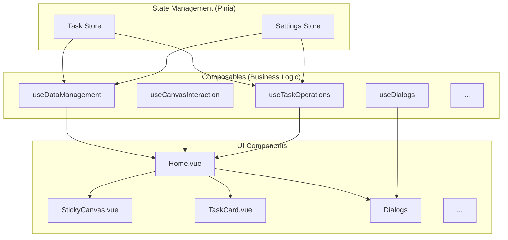

# Home.vue 重构指南

本文档旨在详细说明对 `Home.vue` 组件进行大规模重构后的新代码架构、设计模式和最佳实践。本次重构的主要目标是解决原始 `Home.vue` 文件过大（超过 4000 行）导致的维护性、可读性和可扩展性问题。

## 1. 核心理念：关注点分离

重构的核心思想是将 `Home.vue` 的不同功能点分离到独立的、可复用的 Vue Composables (组合式函数) 和 Components (组件) 中。

- **Composables**: 负责处理业务逻辑、状态管理和副作用。
- **Components**: 负责 UI 渲染和用户交互。

`Home.vue` 现在作为一个顶层协调器，负责整合这些 Composables 和 Components。

## 2. 新架构概览

新架构可以用下图表示：



## 3. Composable Functions (`/src/composables`)

所有可复用的业务逻辑都被提取到了 `src/composables/` 目录下的组合式函数中。

| Composable                  | 职责描述                                                     |
| --------------------------- | ------------------------------------------------------------ |
| `useDataManagement.ts`      | 负责从后端加载、保存和管理任务及模块数据。                     |
| `useTaskOperations.ts`      | 封装了对任务的各种操作（增、删、改）。                         |
| `useCanvasInteraction.ts`   | 管理画布的交互逻辑，如拖拽、选择。                           |
| `useCanvasPanZoom.ts`       | 处理画布的平移和缩放。                                       |
| `useConnections.ts`         | 管理任务之间的连接线逻辑。                                   |
| `useDragAndDrop.ts`         | 负责任务卡片的拖放功能。                                     |
| `useDialogs.ts`             | 集中管理所有对话框的显示/隐藏状态。                          |
| `useHomeAI.ts`              | 封装各类 AI 功能的调用和状态管理。                           |
| `useKeyboardShortcuts.ts`   | 定义和管理全局键盘快捷键。                                   |
| ...                         | (其他 আরও 功能单一的 composables)                              |

**使用范例 (`useDialogs`)**:
```typescript
// a.ts
import { useDialogs } from '@/composables/dialogs/useDialogs';
const dialogs = useDialogs();
dialogs.openQuickAdd();
```
这个模式取代了之前在 `Home.vue` 中使用大量 `ref` 来控制对话框可见性的做法。

## 4. Component Structure (`/src/components`)

UI 组件也被大规模拆分和重组。

### 目录结构

- **`/components/dialogs`**: 存放所有独立的对话框组件。
- **`/components/task`**: `TaskCard.vue` 的子组件，如 `TaskCardHeader`、`TaskCardBody` 等。
- **`/components/canvas`**: `StickyCanvas.vue` 的子组件，如 `CanvasControls`、`TaskRenderer` 等。

### 主要组件

- **`Home.vue`**:
  - 作为应用的**主布局容器**和**协调器**。
  - **不包含**具体的业务逻辑或复杂的 UI 状态。
  - 主要工作是初始化 Composables、加载数据，并将功能和数据传递给子组件。

- **`StickyCanvas.vue`**:
  - 负责渲染任务卡片和它们之间的连接。
  - 交互逻辑（如拖放、缩放）已移至相关的 Composables。
  - **待办**: 该组件仍然非常庞大（~2000行），是下一步重构的重点。可以考虑将其进一步拆分为 `TaskLayer`、`ConnectionLayer`、`InteractionLayer` 等。

- **`TaskCard.vue`**:
  - 显示单个任务的信息。
  - 已被拆分为多个子组件 (e.g., `TaskCardHeader`, `TaskCardBody`, `TaskCardFooter`)，使其内部结构更清晰。

- **对话框 (`/dialogs`)**:
  - 每个对话框都是一个独立的组件，例如 `QuickAddDialog.vue`。
  - 它们的显示状态由 `useDialogs` composable 全局管理。

## 5. 状态管理

- **Pinia**: 继续作为主要的状态管理库，用于存储全局应用状态（如任务列表 `tasks.ts` 和设置 `settings.ts`）。
- **Composables**: 用于管理本地的、与特定功能相关的状态（例如 `useDialogs` 中的对话框可见性状态）。

## 6. 最佳实践与开发约定

1.  **单一职责原则**: 每个组件和 Composable 都应只有一个明确的职责。
2.  **优先使用 Composables**: 新的业务逻辑应优先考虑在 Composable 中实现，而不是直接写在组件里。
3.  **统一的对话框管理**: 所有新对话框都应在 `useDialogs.ts` 中注册和管理。
4.  **避免 Prop Drilling**: 对于深度嵌套的组件，优先使用 Pinia 或提供/注入（Provide/Inject）来传递状态，而不是逐层传递 props。
5.  **组件拆分**: 当一个组件变得过于复杂时（例如超过 300-400 行），应考虑将其拆分为更小的子组件。

---

本文档应作为新功能开发和代码维护的参考。通过遵循这些原则，我们可以确保代码库在未来保持健康和可维护。 