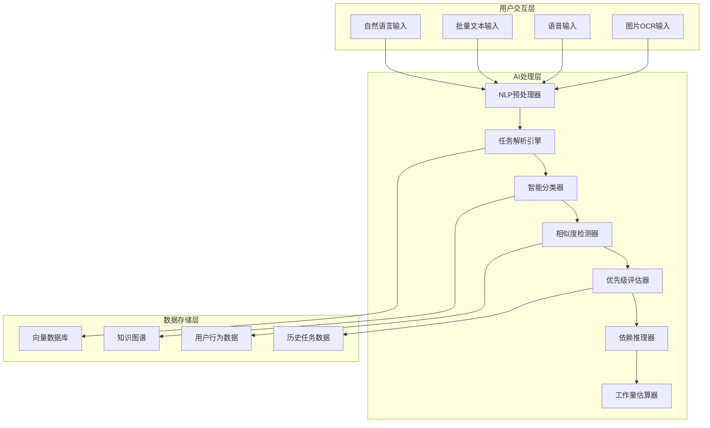
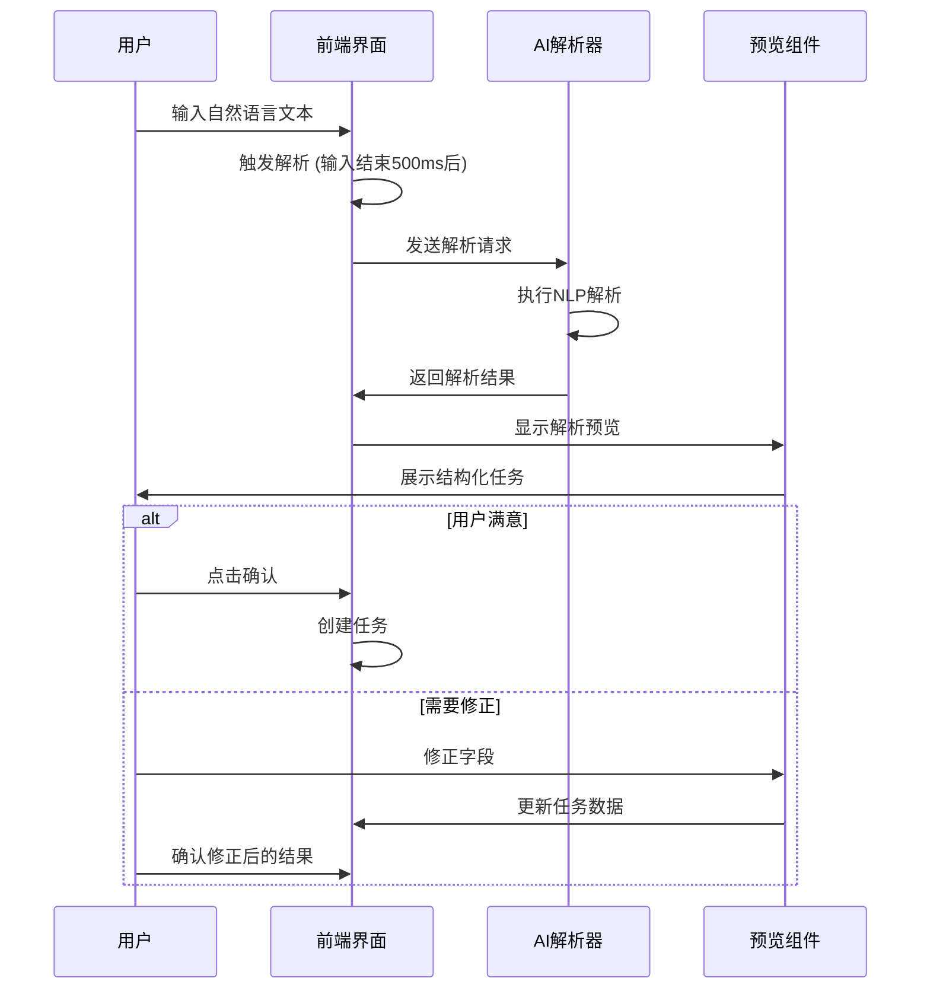

# TaskWall v3.0 AI功能详细规格说明

## 文档信息
- **版本**: v3.0
- **文档类型**: AI功能规格说明
- **创建日期**: 2025-06-21
- **关联文档**: PRD-v3.0-Master.md

---

## 1. AI功能架构概览

### 1.1 AI服务整体架构



### 1.2 核心AI组件说明

| 组件名称 | 功能描述 | 输入 | 输出 | 准确率目标 |
|----------|----------|------|------|------------|
| **NLP预处理器** | 文本清洗、分词、实体识别 | 原始文本 | 结构化数据 | >95% |
| **任务解析引擎** | 从文本中提取任务信息 | 结构化文本 | 任务对象列表 | >85% |
| **智能分类器** | 自动任务分类和标签 | 任务对象 | 分类结果 | >80% |
| **相似度检测器** | 识别重复和相似任务 | 任务向量 | 相似度分数 | >90% |
| **优先级评估器** | 智能优先级建议 | 任务+上下文 | 优先级分数 | >75% |
| **依赖推理器** | 推断任务间依赖关系 | 任务集合 | 依赖图 | >75% |
| **工作量估算器** | 预估任务所需时间 | 任务+历史数据 | 时间估算 | 偏差<20% |

---

## 2. 自然语言任务解析

### 2.1 功能规格

#### 2.1.1 解析能力范围
```yaml
支持语言:
  - 中文: 简体中文，支持口语化表达
  - 英文: 美式英语，支持技术术语
  - 混合: 中英文混合输入

任务信息提取:
  - 标题: 任务名称自动提取
  - 描述: 详细说明智能补全
  - 优先级: 基于关键词推断 (紧急、重要、尽快等)
  - 截止时间: 时间表达式识别 (明天、下周五、3天内等)
  - 任务类型: 动作词分析 (开发、设计、测试、会议等)
  - 责任人: @用户名 或 "找XX" 识别
  - 标签: #标签 自动识别
```

#### 2.1.2 解析算法设计
```python
class TaskNLPParser:
    def __init__(self):
        self.nlp_model = self._load_nlp_model()
        self.time_parser = TimeExpressionParser()
        self.priority_keywords = self._load_priority_keywords()
        self.action_verbs = self._load_action_verbs()
    
    def parse_task_from_text(self, text: str) -> ParsedTask:
        """
        解析自然语言文本为结构化任务
        """
        # 1. 文本预处理
        cleaned_text = self._preprocess_text(text)
        
        # 2. 实体识别
        entities = self._extract_entities(cleaned_text)
        
        # 3. 时间表达式识别
        time_info = self.time_parser.extract_time(cleaned_text)
        
        # 4. 优先级关键词匹配
        priority = self._infer_priority(cleaned_text)
        
        # 5. 任务类型分类
        task_type = self._classify_task_type(cleaned_text)
        
        # 6. 生成结构化任务
        return ParsedTask(
            title=self._extract_title(cleaned_text, entities),
            description=self._extract_description(cleaned_text),
            priority=priority,
            deadline=time_info.deadline,
            task_type=task_type,
            tags=entities.get('tags', []),
            assignee=entities.get('assignee'),
            confidence=self._calculate_confidence()
        )
    
    def _extract_title(self, text: str, entities: dict) -> str:
        """
        提取任务标题的算法
        """
        # 1. 寻找动作词 + 目标对象的组合
        action_patterns = self._find_action_patterns(text)
        
        # 2. 如果有明确的动作词，以动作词开头构建标题
        if action_patterns:
            return self._build_title_from_action(action_patterns[0])
        
        # 3. 否则提取句子主干作为标题
        return self._extract_sentence_core(text)[:50]
    
    def _infer_priority(self, text: str) -> int:
        """
        基于关键词推断优先级
        """
        priority_scores = {
            0: ['紧急', '立即', '马上', '今天必须', 'urgent', 'asap'],
            1: ['重要', '尽快', '优先', '这周', 'important', 'high'],
            2: ['一般', '正常', '常规', 'normal', 'medium'], 
            3: ['不急', '有时间', '低优先级', 'low', 'later'],
            4: ['以后', '有空', '备用', 'backlog', 'someday']
        }
        
        for priority, keywords in priority_scores.items():
            if any(keyword in text.lower() for keyword in keywords):
                return priority
        
        return 2  # 默认中等优先级
```

#### 2.1.3 批量解析策略
```python
class BatchTaskParser:
    def parse_batch_text(self, text: str) -> List[ParsedTask]:
        """
        批量解析文本中的多个任务
        """
        # 1. 任务边界识别
        task_segments = self._segment_tasks(text)
        
        # 2. 逐个解析任务
        parsed_tasks = []
        for segment in task_segments:
            task = self.single_parser.parse_task_from_text(segment)
            parsed_tasks.append(task)
        
        # 3. 任务关系推断
        self._infer_task_relationships(parsed_tasks)
        
        return parsed_tasks
    
    def _segment_tasks(self, text: str) -> List[str]:
        """
        识别文本中的任务边界
        
        识别规则:
        1. 换行符分割
        2. 序号标识 (1. 2. - * 等)
        3. 动作词开头
        4. 语义边界识别
        """
        segments = []
        
        # 按行分割
        lines = text.split('\n')
        
        for line in lines:
            line = line.strip()
            if not line:
                continue
                
            # 检查是否是任务行
            if self._is_task_line(line):
                segments.append(line)
            else:
                # 可能是上一个任务的补充说明
                if segments:
                    segments[-1] += ' ' + line
                else:
                    segments.append(line)
        
        return segments
    
    def _is_task_line(self, line: str) -> bool:
        """
        判断是否是任务行
        """
        # 检查序号标识
        if re.match(r'^\d+[\.\)]\s*', line):
            return True
        
        # 检查列表标识
        if re.match(r'^[-\*\+]\s*', line):
            return True
        
        # 检查动作词开头
        action_verbs = ['做', '完成', '开发', '设计', '测试', '写', '创建', '修复']
        for verb in action_verbs:
            if line.startswith(verb):
                return True
        
        return False
```

### 2.2 用户交互设计

#### 2.2.1 解析界面流程


#### 2.2.2 解析预览组件
```vue
<template>
  <div class="task-parse-preview">
    <div class="parse-header">
      <h3>AI解析结果</h3>
      <div class="confidence-badge" :class="confidenceClass">
        置信度: {{ confidence }}%
      </div>
    </div>
    
    <div class="parsed-tasks">
      <div 
        v-for="(task, index) in parsedTasks" 
        :key="index"
        class="parsed-task-card"
      >
        <!-- 任务标题编辑 -->
        <div class="task-field">
          <label>标题</label>
          <el-input 
            v-model="task.title"
            placeholder="AI解析的任务标题"
            @change="updateTask(index, 'title', $event)"
          />
        </div>
        
        <!-- 优先级选择 -->
        <div class="task-field">
          <label>优先级</label>
          <el-select v-model="task.priority">
            <el-option 
              v-for="p in priorityOptions" 
              :key="p.value"
              :label="p.label" 
              :value="p.value"
            />
          </el-select>
          <span class="ai-suggestion" v-if="task.aiSuggestion.priority">
            AI建议: {{ getPriorityLabel(task.aiSuggestion.priority) }}
          </span>
        </div>
        
        <!-- 截止时间 -->
        <div class="task-field" v-if="task.deadline">
          <label>截止时间</label>
          <el-date-picker
            v-model="task.deadline"
            type="datetime"
          />
          <span class="ai-explanation">
            {{ task.aiExplanation.deadline }}
          </span>
        </div>
        
        <!-- 任务描述 -->
        <div class="task-field">
          <label>描述</label>
          <el-input
            v-model="task.description"
            type="textarea"
            :rows="2"
            placeholder="任务详细描述"
          />
        </div>
      </div>
    </div>
    
    <div class="preview-actions">
      <el-button @click="$emit('cancel')">重新输入</el-button>
      <el-button type="primary" @click="confirmTasks">
        创建 {{ parsedTasks.length }} 个任务
      </el-button>
    </div>
  </div>
</template>

<script setup lang="ts">
interface ParsedTask {
  title: string
  description: string
  priority: number
  deadline?: Date
  tags: string[]
  confidence: number
  aiSuggestion: {
    priority?: number
    deadline?: Date
    explanation: string
  }
  aiExplanation: {
    deadline?: string
    priority?: string
  }
}

const props = defineProps<{
  parsedTasks: ParsedTask[]
  confidence: number
}>()

const emit = defineEmits<{
  confirm: [tasks: ParsedTask[]]
  cancel: []
}>()

const confidenceClass = computed(() => {
  if (props.confidence >= 90) return 'high'
  if (props.confidence >= 70) return 'medium'
  return 'low'
})

function updateTask(index: number, field: string, value: any) {
  props.parsedTasks[index][field] = value
}

function confirmTasks() {
  emit('confirm', props.parsedTasks)
}
</script>
```

---

## 3. 智能任务分类与去重

### 3.1 分类算法设计

#### 3.1.1 多维度分类策略
```python
class TaskClassifier:
    def __init__(self):
        self.semantic_classifier = SemanticClassifier()
        self.behavioral_classifier = BehavioralClassifier()
        self.temporal_classifier = TemporalClassifier()
        self.project_classifier = ProjectClassifier()
        
    def classify_task(self, task: Task, user_context: UserContext) -> ClassificationResult:
        """
        多维度任务分类
        """
        # 1. 语义分类 - 基于任务内容
        semantic_result = self.semantic_classifier.classify(
            text=f"{task.title} {task.description}",
            categories=user_context.existing_categories
        )
        
        # 2. 行为模式分类 - 基于用户历史
        behavioral_result = self.behavioral_classifier.classify(
            task=task,
            user_history=user_context.task_history
        )
        
        # 3. 时间模式分类 - 基于时间特征
        temporal_result = self.temporal_classifier.classify(
            deadline=task.deadline,
            creation_time=task.created_at
        )
        
        # 4. 项目关联分类 - 基于项目上下文
        project_result = self.project_classifier.classify(
            task=task,
            active_projects=user_context.active_projects
        )
        
        # 5. 综合决策
        final_category = self._merge_classification_results([
            semantic_result,
            behavioral_result, 
            temporal_result,
            project_result
        ])
        
        return ClassificationResult(
            category=final_category.category,
            confidence=final_category.confidence,
            reasoning=final_category.reasoning,
            alternative_suggestions=final_category.alternatives
        )
```

#### 3.1.2 语义分类实现
```python
class SemanticClassifier:
    def __init__(self):
        self.model = SentenceTransformer('paraphrase-multilingual-MiniLM-L12-v2')
        self.category_vectors = {}
        
    def classify(self, text: str, categories: List[str]) -> SemanticResult:
        """
        基于语义相似度的分类
        """
        # 1. 计算任务文本向量
        task_vector = self.model.encode(text)
        
        # 2. 计算与各类别的相似度
        similarities = {}
        for category in categories:
            if category not in self.category_vectors:
                self.category_vectors[category] = self._compute_category_vector(category)
            
            similarity = cosine_similarity(
                task_vector.reshape(1, -1),
                self.category_vectors[category].reshape(1, -1)
            )[0][0]
            
            similarities[category] = similarity
        
        # 3. 选择最相似的类别
        best_category = max(similarities.items(), key=lambda x: x[1])
        
        return SemanticResult(
            category=best_category[0],
            confidence=best_category[1],
            all_similarities=similarities
        )
    
    def _compute_category_vector(self, category: str) -> np.ndarray:
        """
        计算类别的向量表示
        基于该类别下历史任务的平均向量
        """
        category_tasks = self._get_category_tasks(category)
        if not category_tasks:
            # 如果没有历史任务，使用类别名称的向量
            return self.model.encode(category)
        
        task_vectors = [
            self.model.encode(f"{task.title} {task.description}")
            for task in category_tasks
        ]
        
        return np.mean(task_vectors, axis=0)
```

### 3.2 去重检测算法

#### 3.2.1 相似度计算
```python
class TaskDeduplicator:
    def __init__(self):
        self.similarity_threshold = 0.85
        self.vector_db = VectorDatabase()
        
    def find_similar_tasks(self, new_task: Task) -> List[SimilarTask]:
        """
        查找相似任务
        """
        # 1. 生成任务向量
        task_vector = self._vectorize_task(new_task)
        
        # 2. 在向量数据库中搜索相似任务
        similar_vectors = self.vector_db.search(
            vector=task_vector,
            top_k=10,
            threshold=self.similarity_threshold
        )
        
        # 3. 详细相似度分析
        similar_tasks = []
        for result in similar_vectors:
            task = self._get_task_by_id(result.task_id)
            detailed_similarity = self._calculate_detailed_similarity(new_task, task)
            
            if detailed_similarity.overall_score >= self.similarity_threshold:
                similar_tasks.append(SimilarTask(
                    task=task,
                    similarity=detailed_similarity,
                    merge_suggestion=self._generate_merge_suggestion(new_task, task)
                ))
        
        return similar_tasks
    
    def _calculate_detailed_similarity(self, task1: Task, task2: Task) -> DetailedSimilarity:
        """
        计算详细相似度
        """
        # 1. 标题相似度
        title_sim = self._text_similarity(task1.title, task2.title)
        
        # 2. 描述相似度  
        desc_sim = self._text_similarity(task1.description, task2.description)
        
        # 3. 时间相近度
        time_sim = self._time_proximity(task1.deadline, task2.deadline)
        
        # 4. 类别匹配度
        category_sim = 1.0 if task1.category == task2.category else 0.0
        
        # 5. 优先级匹配度
        priority_sim = 1.0 - abs(task1.priority - task2.priority) / 4.0
        
        # 6. 综合计算
        overall_score = (
            title_sim * 0.4 +
            desc_sim * 0.3 +
            time_sim * 0.1 +
            category_sim * 0.1 +
            priority_sim * 0.1
        )
        
        return DetailedSimilarity(
            overall_score=overall_score,
            title_similarity=title_sim,
            description_similarity=desc_sim,
            time_proximity=time_sim,
            category_match=category_sim,
            priority_match=priority_sim
        )
```

#### 3.2.2 智能合并建议
```python
class TaskMerger:
    def generate_merge_suggestion(self, task1: Task, task2: Task) -> MergeSuggestion:
        """
        生成任务合并建议
        """
        # 1. 分析合并可行性
        feasibility = self._analyze_merge_feasibility(task1, task2)
        
        if not feasibility.is_feasible:
            return MergeSuggestion(
                recommended=False,
                reason=feasibility.reason
            )
        
        # 2. 生成合并后的任务
        merged_task = self._create_merged_task(task1, task2)
        
        # 3. 分析合并收益
        benefits = self._analyze_merge_benefits(task1, task2, merged_task)
        
        return MergeSuggestion(
            recommended=True,
            merged_task=merged_task,
            benefits=benefits,
            confidence=feasibility.confidence,
            explanation=self._generate_merge_explanation(task1, task2, benefits)
        )
    
    def _create_merged_task(self, task1: Task, task2: Task) -> Task:
        """
        创建合并后的任务
        """
        # 1. 选择更完整的标题
        title = task1.title if len(task1.title) > len(task2.title) else task2.title
        
        # 2. 合并描述
        description = self._merge_descriptions(task1.description, task2.description)
        
        # 3. 选择更高的优先级
        priority = min(task1.priority, task2.priority)
        
        # 4. 选择更早的截止时间
        deadline = min(task1.deadline, task2.deadline) if task1.deadline and task2.deadline else (task1.deadline or task2.deadline)
        
        # 5. 合并标签
        tags = list(set(task1.tags + task2.tags))
        
        return Task(
            title=title,
            description=description,
            priority=priority,
            deadline=deadline,
            tags=tags,
            estimated_hours=max(task1.estimated_hours, task2.estimated_hours)
        )
```

---

## 4. 智能优先级评估

### 4.1 优先级评估算法

#### 4.1.1 多因子评估模型
```python
class PriorityEstimator:
    def __init__(self):
        self.time_weight = 0.3      # 时间紧急度权重
        self.importance_weight = 0.4 # 重要性权重
        self.dependency_weight = 0.2 # 依赖关系影响权重
        self.historical_weight = 0.1 # 历史模式权重
        
    def estimate_priority(self, task: Task, context: TaskContext) -> PriorityEstimation:
        """
        综合评估任务优先级
        """
        # 1. 时间紧急度评估
        urgency_score = self._calculate_time_urgency(task.deadline)
        
        # 2. 任务重要性评估
        importance_score = self._analyze_task_importance(task, context)
        
        # 3. 依赖关系影响评估
        dependency_score = self._calculate_dependency_impact(task, context.all_tasks)
        
        # 4. 历史模式匹配
        historical_score = self._match_historical_pattern(task, context.user_history)
        
        # 5. 综合计算
        final_score = (
            urgency_score * self.time_weight +
            importance_score * self.importance_weight +
            dependency_score * self.dependency_weight +
            historical_score * self.historical_weight
        )
        
        # 6. 分数转换为优先级等级
        priority_level = self._score_to_priority_level(final_score)
        
        return PriorityEstimation(
            recommended_priority=priority_level,
            confidence=self._calculate_confidence(urgency_score, importance_score),
            reasoning=self._generate_reasoning(urgency_score, importance_score, dependency_score),
            factors={
                'time_urgency': urgency_score,
                'importance': importance_score, 
                'dependency_impact': dependency_score,
                'historical_pattern': historical_score
            }
        )
    
    def _calculate_time_urgency(self, deadline: Optional[datetime]) -> float:
        """
        计算时间紧急度
        """
        if not deadline:
            return 0.5  # 无截止时间，中等紧急度
            
        now = datetime.now()
        time_diff = (deadline - now).total_seconds()
        
        # 时间紧急度曲线 - 指数衰减
        if time_diff <= 0:
            return 1.0  # 已过期，最高紧急度
        elif time_diff <= 3600:  # 1小时内
            return 0.95
        elif time_diff <= 86400:  # 1天内
            return 0.8
        elif time_diff <= 604800:  # 1周内
            return 0.6
        elif time_diff <= 2592000:  # 1月内
            return 0.4
        else:
            return 0.2  # 1月以上，低紧急度
    
    def _analyze_task_importance(self, task: Task, context: TaskContext) -> float:
        """
        分析任务重要性
        """
        importance_indicators = {
            # 关键词权重
            'keywords': {
                '重要': 0.8, '关键': 0.8, '核心': 0.7,
                '客户': 0.7, '用户': 0.6, '产品': 0.6,
                '发布': 0.8, '上线': 0.8, '部署': 0.7,
                'critical': 0.9, 'important': 0.8, 'key': 0.7
            },
            # 任务类型权重
            'task_types': {
                '修复': 0.7, '紧急修复': 0.9, 'hotfix': 0.9,
                '发布': 0.8, '部署': 0.7, 'release': 0.8,
                '会议': 0.6, '评审': 0.6, 'meeting': 0.6
            }
        }
        
        score = 0.5  # 基础分数
        text = f"{task.title} {task.description}".lower()
        
        # 关键词匹配
        for keyword, weight in importance_indicators['keywords'].items():
            if keyword in text:
                score = min(1.0, score + weight * 0.2)
        
        # 任务类型匹配
        for task_type, weight in importance_indicators['task_types'].items():
            if task_type in text:
                score = min(1.0, score + weight * 0.3)
        
        # 工作量调整 - 工作量大的任务通常更重要
        if task.estimated_hours:
            if task.estimated_hours >= 8:
                score = min(1.0, score + 0.2)
            elif task.estimated_hours >= 4:
                score = min(1.0, score + 0.1)
        
        return score
```

#### 4.1.2 依赖关系影响分析
```python
def _calculate_dependency_impact(self, task: Task, all_tasks: List[Task]) -> float:
    """
    计算依赖关系对优先级的影响
    """
    # 1. 分析该任务阻塞了多少其他任务
    blocking_count = 0
    blocked_by_count = 0
    
    for other_task in all_tasks:
        if self._is_dependency_exists(task.id, other_task.id):
            blocking_count += 1
        elif self._is_dependency_exists(other_task.id, task.id):
            blocked_by_count += 1
    
    # 2. 计算影响分数
    # 阻塞其他任务越多，优先级越高
    blocking_impact = min(1.0, blocking_count * 0.2)
    
    # 被其他任务阻塞，优先级降低
    blocked_impact = min(0.5, blocked_by_count * 0.1)
    
    # 3. 分析阻塞任务的重要性
    critical_blocked_tasks = self._count_critical_blocked_tasks(task, all_tasks)
    critical_impact = min(0.3, critical_blocked_tasks * 0.1)
    
    return blocking_impact + critical_impact - blocked_impact
```

### 4.2 优先级推荐界面

#### 4.2.1 智能推荐组件
```vue
<template>
  <div class="priority-recommendation">
    <div class="current-priority">
      <label>当前优先级</label>
      <el-select v-model="currentPriority" @change="onPriorityChange">
        <el-option
          v-for="option in priorityOptions"
          :key="option.value"
          :label="option.label"
          :value="option.value"
        />
      </el-select>
    </div>
    
    <div class="ai-recommendation" v-if="aiRecommendation">
      <div class="recommendation-header">
        <i class="ai-icon">🤖</i>
        <span>AI建议</span>
        <el-tag :type="confidenceType">
          置信度 {{ aiRecommendation.confidence }}%
        </el-tag>
      </div>
      
      <div class="recommendation-content">
        <div class="suggested-priority">
          建议优先级: 
          <strong :class="`priority-${aiRecommendation.recommended_priority}`">
            {{ getPriorityLabel(aiRecommendation.recommended_priority) }}
          </strong>
          
          <el-button
            v-if="aiRecommendation.recommended_priority !== currentPriority"
            type="primary"
            size="small"
            @click="applyAIRecommendation"
          >
            采用建议
          </el-button>
        </div>
        
        <div class="reasoning">
          <h4>分析原因</h4>
          <ul>
            <li v-for="reason in aiRecommendation.reasoning" :key="reason">
              {{ reason }}
            </li>
          </ul>
        </div>
        
        <div class="factors-breakdown">
          <h4>评估因子</h4>
          <div class="factor-bars">
            <div class="factor-bar" v-for="(score, factor) in aiRecommendation.factors" :key="factor">
              <span class="factor-label">{{ getFactorLabel(factor) }}</span>
              <div class="progress-bar">
                <div 
                  class="progress-fill" 
                  :style="{ width: (score * 100) + '%' }"
                  :class="getFactorColorClass(factor)"
                ></div>
              </div>
              <span class="factor-score">{{ Math.round(score * 100) }}%</span>
            </div>
          </div>
        </div>
      </div>
    </div>
  </div>
</template>

<script setup lang="ts">
interface PriorityRecommendation {
  recommended_priority: number
  confidence: number
  reasoning: string[]
  factors: {
    time_urgency: number
    importance: number
    dependency_impact: number
    historical_pattern: number
  }
}

const props = defineProps<{
  task: Task
  aiRecommendation?: PriorityRecommendation
}>()

const emit = defineEmits<{
  priorityChanged: [priority: number]
}>()

const currentPriority = ref(props.task.priority)

const confidenceType = computed(() => {
  if (!props.aiRecommendation) return 'info'
  const confidence = props.aiRecommendation.confidence
  if (confidence >= 80) return 'success'
  if (confidence >= 60) return 'warning'
  return 'danger'
})

function applyAIRecommendation() {
  if (props.aiRecommendation) {
    currentPriority.value = props.aiRecommendation.recommended_priority
    emit('priorityChanged', currentPriority.value)
  }
}

function getFactorLabel(factor: string): string {
  const labels = {
    time_urgency: '时间紧急度',
    importance: '任务重要性',
    dependency_impact: '依赖关系影响',
    historical_pattern: '历史模式匹配'
  }
  return labels[factor] || factor
}

function getFactorColorClass(factor: string): string {
  const classes = {
    time_urgency: 'urgency',
    importance: 'importance', 
    dependency_impact: 'dependency',
    historical_pattern: 'historical'
  }
  return classes[factor] || 'default'
}
</script>

<style scoped>
.priority-recommendation {
  padding: 16px;
  border: 1px solid var(--border-color);
  border-radius: 8px;
  margin-bottom: 16px;
}

.ai-recommendation {
  margin-top: 16px;
  padding: 12px;
  background: rgba(64, 158, 255, 0.05);
  border-radius: 6px;
}

.recommendation-header {
  display: flex;
  align-items: center;
  gap: 8px;
  margin-bottom: 12px;
}

.ai-icon {
  font-size: 16px;
}

.factors-breakdown {
  margin-top: 12px;
}

.factor-bar {
  display: flex;
  align-items: center;
  gap: 8px;
  margin-bottom: 6px;
}

.factor-label {
  width: 100px;
  font-size: 12px;
  color: var(--text-secondary);
}

.progress-bar {
  flex: 1;
  height: 8px;
  background: var(--bg-secondary);
  border-radius: 4px;
  overflow: hidden;
}

.progress-fill {
  height: 100%;
  transition: width 0.3s ease;
}

.progress-fill.urgency { background: #ff4757; }
.progress-fill.importance { background: #ffa502; }
.progress-fill.dependency { background: #3742fa; }
.progress-fill.historical { background: #2ed573; }

.factor-score {
  width: 40px;
  text-align: right;
  font-size: 12px;
  font-weight: bold;
}
</style>
```

---

## 5. 基础依赖关系推理

### 5.1 依赖推理算法

#### 5.1.1 多层次依赖分析
```python
class DependencyInferrer:
    def __init__(self):
        self.semantic_analyzer = SemanticDependencyAnalyzer()
        self.temporal_analyzer = TemporalDependencyAnalyzer()
        self.resource_analyzer = ResourceDependencyAnalyzer()
        self.pattern_analyzer = PatternDependencyAnalyzer()
        
    def infer_dependencies(self, tasks: List[Task]) -> List[TaskDependency]:
        """
        推断任务间的依赖关系
        """
        dependencies = []
        
        # 1. 语义依赖分析
        semantic_deps = self.semantic_analyzer.analyze(tasks)
        dependencies.extend(semantic_deps)
        
        # 2. 时序依赖分析
        temporal_deps = self.temporal_analyzer.analyze(tasks)
        dependencies.extend(temporal_deps)
        
        # 3. 资源依赖分析
        resource_deps = self.resource_analyzer.analyze(tasks)
        dependencies.extend(resource_deps)
        
        # 4. 模式依赖分析
        pattern_deps = self.pattern_analyzer.analyze(tasks)
        dependencies.extend(pattern_deps)
        
        # 5. 去重和置信度过滤
        filtered_deps = self._filter_and_deduplicate(dependencies)
        
        return filtered_deps
```

#### 5.1.2 语义依赖分析
```python
class SemanticDependencyAnalyzer:
    def __init__(self):
        self.dependency_patterns = self._load_dependency_patterns()
        self.nlp_model = load_language_model()
        
    def analyze(self, tasks: List[Task]) -> List[TaskDependency]:
        """
        基于语义分析推断依赖关系
        """
        dependencies = []
        
        for i, task1 in enumerate(tasks):
            for j, task2 in enumerate(tasks):
                if i >= j:  # 避免重复分析
                    continue
                    
                dependency = self._analyze_task_pair(task1, task2)
                if dependency:
                    dependencies.append(dependency)
        
        return dependencies
    
    def _analyze_task_pair(self, task1: Task, task2: Task) -> Optional[TaskDependency]:
        """
        分析两个任务之间的语义依赖
        """
        # 1. 关键词依赖模式匹配
        keyword_dep = self._match_keyword_patterns(task1, task2)
        if keyword_dep:
            return keyword_dep
        
        # 2. 动作序列分析
        action_dep = self._analyze_action_sequence(task1, task2)
        if action_dep:
            return action_dep
        
        # 3. 对象依赖分析
        object_dep = self._analyze_object_dependency(task1, task2)
        if object_dep:
            return object_dep
        
        return None
    
    def _match_keyword_patterns(self, task1: Task, task2: Task) -> Optional[TaskDependency]:
        """
        匹配关键词依赖模式
        """
        patterns = {
            # 设计 -> 开发 模式
            ('设计', '开发'): DependencyType.BLOCKS,
            ('design', 'develop'): DependencyType.BLOCKS,
            # 开发 -> 测试 模式
            ('开发', '测试'): DependencyType.BLOCKS,
            ('develop', 'test'): DependencyType.BLOCKS,
            # 测试 -> 部署 模式
            ('测试', '部署'): DependencyType.BLOCKS,
            ('test', 'deploy'): DependencyType.BLOCKS,
            # 需求 -> 设计 模式
            ('需求', '设计'): DependencyType.ENABLES,
            ('requirement', 'design'): DependencyType.ENABLES
        }
        
        task1_text = f"{task1.title} {task1.description}".lower()
        task2_text = f"{task2.title} {task2.description}".lower()
        
        for (keyword1, keyword2), dep_type in patterns.items():
            if keyword1 in task1_text and keyword2 in task2_text:
                return TaskDependency(
                    from_task_id=task1.id,
                    to_task_id=task2.id,
                    dependency_type=dep_type,
                    confidence=0.8,
                    reasoning=f"检测到 {keyword1} -> {keyword2} 依赖模式"
                )
        
        return None
    
    def _analyze_action_sequence(self, task1: Task, task2: Task) -> Optional[TaskDependency]:
        """
        分析动作序列依赖
        """
        # 常见的动作序列
        action_sequences = [
            ['创建', '修改', '完善', '发布'],
            ['规划', '设计', '实现', '测试', '部署'],
            ['收集', '分析', '设计', '开发'],
            ['准备', '执行', '检查', '总结']
        ]
        
        task1_actions = self._extract_actions(task1)
        task2_actions = self._extract_actions(task2)
        
        for sequence in action_sequences:
            task1_pos = self._find_action_position(task1_actions, sequence)
            task2_pos = self._find_action_position(task2_actions, sequence)
            
            if task1_pos is not None and task2_pos is not None:
                if task1_pos < task2_pos:
                    return TaskDependency(
                        from_task_id=task1.id,
                        to_task_id=task2.id,
                        dependency_type=DependencyType.BLOCKS,
                        confidence=0.7,
                        reasoning=f"检测到动作序列依赖: {sequence[task1_pos]} -> {sequence[task2_pos]}"
                    )
        
        return None
```

#### 5.1.3 依赖关系可视化
```vue
<template>
  <div class="dependency-inference-panel">
    <div class="panel-header">
      <h3>🔗 智能依赖推理</h3>
      <el-button @click="runInference" :loading="inferring">
        {{ inferring ? '推理中...' : '运行推理' }}
      </el-button>
    </div>
    
    <div class="inference-results" v-if="inferredDependencies.length > 0">
      <h4>发现 {{ inferredDependencies.length }} 个潜在依赖关系</h4>
      
      <div 
        v-for="dependency in inferredDependencies" 
        :key="`${dependency.from_task_id}-${dependency.to_task_id}`"
        class="dependency-suggestion"
        :class="{ 'high-confidence': dependency.confidence >= 0.8 }"
      >
        <div class="dependency-visual">
          <div class="from-task">
            <span class="task-title">{{ getTaskTitle(dependency.from_task_id) }}</span>
          </div>
          <div class="arrow">
            <i class="dependency-icon" :class="getDependencyIcon(dependency.type)"></i>
            <span class="dependency-type">{{ getDependencyTypeLabel(dependency.type) }}</span>
          </div>
          <div class="to-task">
            <span class="task-title">{{ getTaskTitle(dependency.to_task_id) }}</span>
          </div>
        </div>
        
        <div class="dependency-details">
          <div class="confidence-bar">
            <span class="confidence-label">置信度</span>
            <div class="progress-container">
              <div 
                class="progress-bar"
                :style="{ width: (dependency.confidence * 100) + '%' }"
                :class="getConfidenceClass(dependency.confidence)"
              ></div>
            </div>
            <span class="confidence-value">{{ Math.round(dependency.confidence * 100) }}%</span>
          </div>
          
          <div class="reasoning">
            <strong>推理依据:</strong> {{ dependency.reasoning }}
          </div>
        </div>
        
        <div class="dependency-actions">
          <el-button 
            type="success" 
            size="small"
            @click="acceptDependency(dependency)"
          >
            ✓ 接受
          </el-button>
          <el-button 
            size="small"
            @click="rejectDependency(dependency)"
          >
            ✗ 拒绝
          </el-button>
          <el-button 
            type="info" 
            size="small"
            @click="showDependencyDetails(dependency)"
          >
            详情
          </el-button>
        </div>
      </div>
    </div>
    
    <div class="no-results" v-else-if="!inferring && hasRunInference">
      <div class="empty-state">
        <i class="empty-icon">🔍</i>
        <h3>未发现明显依赖关系</h3>
        <p>当前任务间没有检测到明显的依赖关系。</p>
        <p>您可以手动创建任务间的连线来建立依赖关系。</p>
      </div>
    </div>
  </div>
</template>

<script setup lang="ts">
interface InferredDependency {
  from_task_id: number
  to_task_id: number
  type: DependencyType
  confidence: number
  reasoning: string
}

const props = defineProps<{
  tasks: Task[]
}>()

const inferredDependencies = ref<InferredDependency[]>([])
const inferring = ref(false)
const hasRunInference = ref(false)

async function runInference() {
  inferring.value = true
  hasRunInference.value = true
  
  try {
    const response = await taskStore.inferDependencies(props.tasks.map(t => t.id))
    inferredDependencies.value = response.dependencies
  } catch (error) {
    console.error('Dependency inference failed:', error)
    ElMessage.error('依赖推理失败')
  } finally {
    inferring.value = false
  }
}

function acceptDependency(dependency: InferredDependency) {
  // 创建依赖关系
  taskStore.createDependency({
    from_task_id: dependency.from_task_id,
    to_task_id: dependency.to_task_id,
    dependency_type: dependency.type
  })
  
  // 从建议中移除
  const index = inferredDependencies.value.findIndex(d => 
    d.from_task_id === dependency.from_task_id && 
    d.to_task_id === dependency.to_task_id
  )
  if (index > -1) {
    inferredDependencies.value.splice(index, 1)
  }
  
  ElMessage.success('依赖关系已创建')
}

function rejectDependency(dependency: InferredDependency) {
  // 从建议中移除
  const index = inferredDependencies.value.findIndex(d => 
    d.from_task_id === dependency.from_task_id && 
    d.to_task_id === dependency.to_task_id
  )
  if (index > -1) {
    inferredDependencies.value.splice(index, 1)
  }
}

function getDependencyIcon(type: DependencyType): string {
  const icons = {
    [DependencyType.BLOCKS]: '🚫',
    [DependencyType.ENABLES]: '✅',
    [DependencyType.RELATES]: '🔗',
    [DependencyType.SUBTASK]: '📋',
    [DependencyType.RESOURCE_SHARED]: '📦'
  }
  return icons[type] || '🔗'
}

function getDependencyTypeLabel(type: DependencyType): string {
  const labels = {
    [DependencyType.BLOCKS]: '阻塞',
    [DependencyType.ENABLES]: '启用',
    [DependencyType.RELATES]: '相关',
    [DependencyType.SUBTASK]: '子任务',
    [DependencyType.RESOURCE_SHARED]: '资源共享'
  }
  return labels[type] || '未知'
}
</script>
```

---

## 6. 性能优化与监控

### 6.1 AI性能优化

#### 6.1.1 缓存策略
```python
class AIResultCache:
    def __init__(self):
        self.redis_client = redis.Redis()
        self.cache_ttl = {
            'nlp_parse': 3600,      # 1小时
            'classification': 7200,  # 2小时
            'similarity': 1800,     # 30分钟
            'priority': 900,        # 15分钟
            'dependency': 1800      # 30分钟
        }
    
    def get_cached_result(self, operation: str, input_hash: str) -> Optional[dict]:
        """
        获取缓存的AI处理结果
        """
        cache_key = f"ai_result:{operation}:{input_hash}"
        cached_data = self.redis_client.get(cache_key)
        
        if cached_data:
            return json.loads(cached_data)
        return None
    
    def cache_result(self, operation: str, input_hash: str, result: dict):
        """
        缓存AI处理结果
        """
        cache_key = f"ai_result:{operation}:{input_hash}"
        ttl = self.cache_ttl.get(operation, 1800)
        
        self.redis_client.setex(
            cache_key, 
            ttl, 
            json.dumps(result)
        )
```

#### 6.1.2 批量处理优化
```python
class BatchAIProcessor:
    def __init__(self):
        self.batch_size = 10
        self.max_wait_time = 5  # 秒
        self.pending_requests = []
        
    async def process_batch_classification(self, tasks: List[Task]) -> List[ClassificationResult]:
        """
        批量处理任务分类
        """
        # 1. 分批处理
        results = []
        for i in range(0, len(tasks), self.batch_size):
            batch = tasks[i:i + self.batch_size]
            batch_results = await self._classify_batch(batch)
            results.extend(batch_results)
        
        return results
    
    async def _classify_batch(self, batch: List[Task]) -> List[ClassificationResult]:
        """
        处理单个批次
        """
        # 1. 并行向量化
        task_vectors = await asyncio.gather(*[
            self._vectorize_task_async(task) for task in batch
        ])
        
        # 2. 批量相似度计算
        similarity_matrix = cosine_similarity(task_vectors)
        
        # 3. 批量分类决策
        classifications = []
        for i, task in enumerate(batch):
            classification = self._classify_from_similarity(
                task, 
                similarity_matrix[i]
            )
            classifications.append(classification)
        
        return classifications
```

### 6.2 监控与质量保证

#### 6.2.1 AI功能监控
```python
class AIMonitor:
    def __init__(self):
        self.metrics_collector = MetricsCollector()
        self.error_tracker = ErrorTracker()
        
    def track_ai_operation(self, operation: str, input_data: dict, result: dict, execution_time: float):
        """
        跟踪AI操作的性能指标
        """
        # 1. 记录响应时间
        self.metrics_collector.record_latency(operation, execution_time)
        
        # 2. 记录准确率（如果有ground truth）
        if 'ground_truth' in input_data:
            accuracy = self._calculate_accuracy(result, input_data['ground_truth'])
            self.metrics_collector.record_accuracy(operation, accuracy)
        
        # 3. 记录置信度分布
        if 'confidence' in result:
            self.metrics_collector.record_confidence(operation, result['confidence'])
        
        # 4. 检查异常结果
        if self._is_anomalous_result(operation, result):
            self.error_tracker.log_anomaly(operation, input_data, result)
    
    def get_ai_health_metrics(self) -> dict:
        """
        获取AI功能健康指标
        """
        return {
            'average_latency': self.metrics_collector.get_average_latency(),
            'accuracy_by_operation': self.metrics_collector.get_accuracy_stats(),
            'confidence_distribution': self.metrics_collector.get_confidence_stats(),
            'error_rate': self.error_tracker.get_error_rate(),
            'anomaly_count': self.error_tracker.get_anomaly_count()
        }
```

#### 6.2.2 用户反馈收集
```typescript
interface AIFeedback {
  operation: string
  input_hash: string
  ai_result: any
  user_correction?: any
  feedback_type: 'accept' | 'reject' | 'modify'
  timestamp: Date
}

class AIFeedbackCollector {
  private feedbackBuffer: AIFeedback[] = []
  
  collectFeedback(feedback: AIFeedback) {
    this.feedbackBuffer.push(feedback)
    
    // 定期发送反馈到服务器
    if (this.feedbackBuffer.length >= 10) {
      this.flushFeedback()
    }
  }
  
  private async flushFeedback() {
    if (this.feedbackBuffer.length === 0) return
    
    try {
      await api.post('/ai/feedback', {
        feedback_batch: this.feedbackBuffer
      })
      
      this.feedbackBuffer = []
    } catch (error) {
      console.error('Failed to send AI feedback:', error)
    }
  }
}
```

---

## 7. 总结与规划

### 7.1 功能实现优先级

| 优先级 | 功能模块 | 预计工期 | 关键成功指标 |
|--------|----------|----------|--------------|
| **P0** | 自然语言任务解析 | 2周 | 解析准确率 >85% |
| **P0** | 批量任务录入 | 2周 | 支持5种输入方式 |
| **P1** | 智能任务分类 | 2周 | 分类准确率 >80% |
| **P1** | 任务去重检测 | 2周 | 重复检测F1-Score >85% |
| **P1** | 优先级智能评估 | 2周 | 建议采纳率 >70% |
| **P2** | 依赖关系推理 | 2周 | 推理准确率 >75% |
| **P2** | 工作量评估 | 1周 | 估算偏差 <20% |

### 7.2 技术风险管控

1. **AI准确率风险**: 建立用户反馈循环，持续优化模型
2. **性能问题**: 实施缓存和批量处理策略
3. **用户接受度**: 提供可解释的AI决策和用户控制选项

### 7.3 后续迭代方向

- **多模态输入**: 支持语音、图片等多种输入方式
- **深度学习**: 引入更先进的深度学习模型
- **个性化**: 基于用户行为的个性化AI推荐
- **协作智能**: 团队级别的AI任务管理功能

---

**文档状态**: 本文档将随开发进度持续更新，每个Sprint结束后进行功能规格的详细补充和修正。