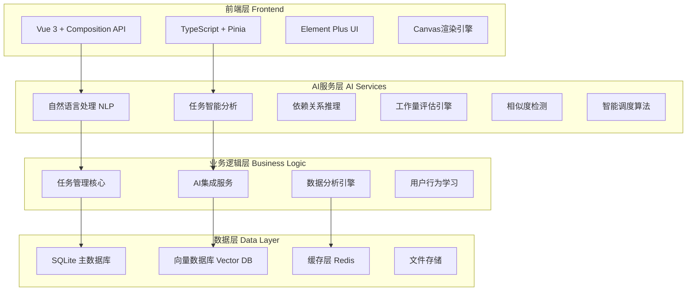
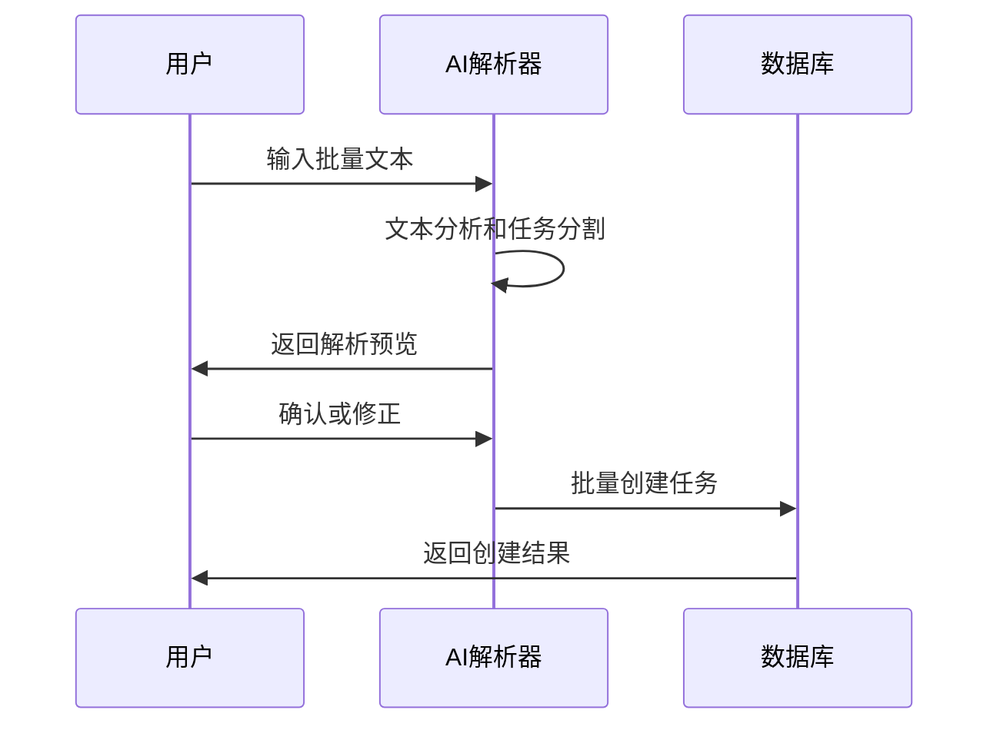
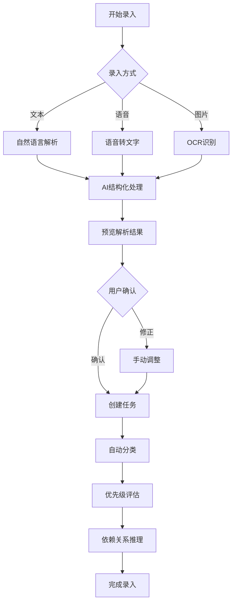

# TaskWall v3.0 产品需求文档 (PRD)

## 文档信息
- **版本**: v3.0
- **创建日期**: 2025-06-21
- **最后更新**: 2025-06-21
- **状态**: 开发中
- **产品**: TaskWall - AI驱动的可视化任务管理平台

---

## 1. 产品概述

### 1.1 产品愿景
TaskWall 3.0 致力于构建一个由AI驱动的智能任务管理生态系统，专为快速记录和自动整理碎片化任务而设计。通过深度AI集成，实现从任务录入到执行规划的全自动化流程。

### 1.2 核心理念
- **极简录入**: 用户只需专注任务录入，其余交给AI
- **智能组织**: AI自动分类、排期和评估工作量
- **高效执行**: 智能依赖推理和优先级管理
- **持续优化**: 基于用户行为的智能学习和建议

### 1.3 目标用户
- 需要管理大量碎片化任务的知识工作者
- 希望减少任务管理时间投入的高效能人士
- 追求自动化工作流程的团队和个人

---

## 2. 产品架构

### 2.1 技术架构升级



### 2.2 核心模块架构

| 模块 | 功能 | 技术栈 | 优先级 |
|------|------|--------|--------|
| **AI输入解析** | 自然语言任务解析、批量输入 | NLP + 规则引擎 | P0 |
| **智能分类** | 自动任务分类和去重 | 机器学习 + 向量相似度 | P0 |
| **依赖推理** | 基础依赖关系自动推断 | 图算法 + AI推理 | P1 |
| **智能调度** | 优先级评估和时间安排 | 启发式算法 + 历史数据 | P1 |
| **体验优化** | 界面响应和交互改进 | 前端优化 + 用户研究 | P2 |

---

## 3. 功能模块详述

### 3.1 Phase 1: AI驱动的任务输入 (Sprint 1-3)

#### 3.1.1 自然语言任务解析
**功能描述**: 允许用户使用自然语言快速描述任务，AI自动解析并结构化

**核心特性**:
- 支持中英文混合输入
- 自动提取任务标题、描述、优先级、时间信息
- 智能识别任务类型和所属模块
- 支持批量任务解析（一次输入多个任务）

**技术实现**:
```python
# AI解析引擎示例
class TaskNLPParser:
    def parse_natural_language(self, text: str) -> List[TaskStructure]:
        # 1. 文本预处理和分词
        # 2. 实体识别（时间、优先级、动作词）
        # 3. 意图分析和任务边界识别
        # 4. 结构化输出生成
        pass
```

**用户交互**:
- 输入框支持 `/` 触发AI解析模式
- 实时预览解析结果
- 支持解析结果的快速修正

#### 3.1.2 批量任务快速录入
**功能描述**: 支持多种方式的批量任务录入

**录入方式**:
1. **文本块解析**: 粘贴大段文本，AI自动分割成多个任务
2. **列表格式**: 支持Markdown列表格式的批量导入
3. **语音转文字**: 语音录入后AI解析（Phase 2）
4. **图片OCR**: 从截图或照片中提取任务信息

**批量处理流程**:


### 3.2 Phase 2: 智能任务管理 (Sprint 4-6)

#### 3.2.1 自动任务分类和去重
**功能描述**: AI自动对任务进行分类并识别重复任务

**分类策略**:
- **语义分类**: 基于任务内容的语义理解
- **行为分类**: 基于用户历史行为模式
- **时间分类**: 基于截止时间和紧急程度
- **项目分类**: 自动识别所属项目或模块

**去重机制**:
- **相似度检测**: 使用向量相似度算法
- **合并建议**: 智能建议任务合并策略
- **用户确认**: 重要决策需用户确认

**技术实现**:
```python
class TaskClassifier:
    def __init__(self):
        self.similarity_threshold = 0.85
        self.vector_db = VectorDatabase()
    
    def classify_task(self, task: Task) -> Classification:
        # 向量化任务内容
        task_vector = self.vectorize_task(task)
        
        # 寻找相似任务
        similar_tasks = self.vector_db.find_similar(
            task_vector, 
            threshold=self.similarity_threshold
        )
        
        # 生成分类建议
        return self.generate_classification(task, similar_tasks)
```

#### 3.2.2 智能优先级评估
**功能描述**: AI自动评估任务优先级并提供调整建议

**评估维度**:
- **截止时间紧急度**: 基于时间距离计算
- **任务重要性**: 基于关键词和上下文分析
- **依赖关系影响**: 分析对其他任务的影响程度
- **历史模式**: 基于用户过往优先级设置习惯

**优先级算法**:
```python
def calculate_priority_score(task: Task) -> PriorityScore:
    urgency_score = calculate_time_urgency(task.deadline)
    importance_score = analyze_task_importance(task.content)
    dependency_impact = calculate_dependency_impact(task.id)
    historical_pattern = get_user_priority_pattern(task.category)
    
    final_score = (
        urgency_score * 0.3 +
        importance_score * 0.4 +
        dependency_impact * 0.2 +
        historical_pattern * 0.1
    )
    
    return PriorityScore(final_score)
```

#### 3.2.3 相似任务自动合并
**功能描述**: 自动识别并建议合并相似任务

**合并策略**:
- **内容相似**: 基于文本相似度
- **时间相近**: 截止时间接近的任务
- **资源共享**: 需要相同资源的任务
- **流程关联**: 属于同一工作流程的任务

### 3.3 Phase 3: 智能依赖与调度 (Sprint 7-8)

#### 3.3.1 基础依赖关系推理
**功能描述**: AI自动分析任务间的依赖关系

**推理逻辑**:
- **语义依赖**: 基于任务描述的语义分析
- **时序依赖**: 基于时间顺序的逻辑推理
- **资源依赖**: 基于共享资源的依赖识别
- **经验依赖**: 基于历史数据的模式识别

**依赖类型**:
```typescript
enum DependencyType {
  BLOCKS = 'blocks',           // 阻塞关系
  ENABLES = 'enables',         // 启用关系
  RELATES = 'relates',         // 相关关系
  SUBTASK = 'subtask',         // 子任务关系
  RESOURCE_SHARED = 'shared'   // 资源共享
}
```

#### 3.3.2 智能工作量评估
**功能描述**: AI自动评估任务所需时间和资源

**评估因子**:
- **任务复杂度**: 基于描述内容分析
- **历史数据**: 相似任务的历史用时
- **用户能力**: 基于用户历史表现
- **外部因素**: 考虑季节性和环境因素

**评估模型**:
```python
class WorkloadEstimator:
    def estimate_effort(self, task: Task, user_profile: UserProfile) -> EstimationResult:
        complexity_score = self.analyze_task_complexity(task)
        historical_data = self.get_similar_task_history(task)
        user_efficiency = user_profile.get_efficiency_for_category(task.category)
        
        base_estimate = complexity_score * historical_data.average_time
        adjusted_estimate = base_estimate / user_efficiency
        
        return EstimationResult(
            hours=adjusted_estimate,
            confidence=self.calculate_confidence(historical_data),
            factors=self.get_estimation_factors()
        )
```

---

## 4. 用户体验设计

### 4.1 交互流程优化

#### 4.1.1 任务录入流程


#### 4.1.2 智能建议交互
- **非侵入式建议**: 在合适时机显示AI建议
- **一键应用**: 支持快速应用AI建议
- **渐进式披露**: 根据用户熟练度调整建议详细程度
- **学习反馈**: 记录用户对建议的接受情况

### 4.2 界面设计原则

#### 4.2.1 AI能力可视化
- **处理状态指示**: 清晰显示AI处理进度
- **智能程度标识**: 显示AI参与程度和可信度
- **解释性设计**: 提供AI决策的简要解释
- **人工介入点**: 明确标识需要人工确认的点

#### 4.2.2 效率优先设计
- **快捷操作**: 最常用操作支持键盘快捷键
- **批量操作**: 支持多任务的批量处理
- **智能预填**: 基于上下文的智能预填功能
- **渐进增强**: 基础功能简单，高级功能可选

---

## 5. 技术实现规划

### 5.1 开发时间线

| 阶段 | 时间 | 主要交付物 | 关键里程碑 |
|------|------|-----------|-----------|
| **Sprint 1** | Week 1-2 | 自然语言解析引擎 | NLP解析准确率>85% |
| **Sprint 2** | Week 3-4 | 批量输入界面 | 支持5种输入方式 |
| **Sprint 3** | Week 5-6 | 任务分类系统 | 自动分类准确率>80% |
| **Sprint 4** | Week 7-8 | 智能去重功能 | 重复检测准确率>90% |
| **Sprint 5** | Week 9-10 | 优先级评估 | 优先级建议采纳率>70% |
| **Sprint 6** | Week 11-12 | 依赖关系推理 | 依赖识别准确率>75% |
| **Sprint 7** | Week 13-14 | 工作量评估 | 评估偏差<20% |
| **Sprint 8** | Week 15 | 系统集成测试 | 完整功能验收 |

### 5.2 技术栈升级

#### 5.2.1 AI/ML 技术栈
```yaml
NLP处理:
  - 主引擎: Google Gemini API
  - 备选: OpenAI GPT-4
  - 本地模型: sentence-transformers (中文支持)

向量数据库:
  - 主选: ChromaDB (轻量级)
  - 备选: Qdrant (高性能)

机器学习:
  - 框架: scikit-learn
  - 深度学习: PyTorch (如需要)
  - 特征工程: pandas + numpy
```

#### 5.2.2 后端架构升级
```python
# 新增AI服务层
from fastapi import FastAPI
from .ai import NLPParser, TaskClassifier, DependencyInferrer
from .services import TaskAIService, WorkloadEstimator

app = FastAPI()

# AI服务路由
@app.post("/ai/parse")
async def parse_natural_language(request: NLPRequest):
    parser = NLPParser()
    return await parser.parse_tasks(request.text)

@app.post("/ai/classify")
async def classify_tasks(request: ClassificationRequest):
    classifier = TaskClassifier()
    return await classifier.classify_batch(request.tasks)
```

#### 5.2.3 前端增强
```typescript
// 新增AI交互组件
export interface AIAssistantState {
  isProcessing: boolean
  suggestions: AISuggestion[]
  confidence: number
  explanations: string[]
}

// AI建议组件
export const AISmartSuggestions = defineComponent({
  setup() {
    const aiState = reactive<AIAssistantState>({
      isProcessing: false,
      suggestions: [],
      confidence: 0,
      explanations: []
    })
    
    return { aiState }
  }
})
```

---

## 6. 性能与质量指标

### 6.1 AI功能性能指标

| 功能模块 | 性能指标 | 目标值 | 测量方法 |
|----------|----------|--------|----------|
| **自然语言解析** | 解析准确率 | >85% | 人工标注测试集 |
| **任务分类** | 分类准确率 | >80% | 混淆矩阵分析 |
| **去重检测** | 查准率/查全率 | >90%/80% | F1-Score评估 |
| **依赖推理** | 推理准确率 | >75% | 专家评估验证 |
| **工作量评估** | 估算偏差 | <20% | 实际用时对比 |

### 6.2 用户体验指标

| 指标类别 | 具体指标 | 目标值 | 测量周期 |
|----------|----------|--------|----------|
| **效率提升** | 任务录入时间 | 减少50% | 每周 |
| **用户满意度** | AI建议采纳率 | >70% | 每月 |
| **系统性能** | 响应时间 | <2秒 | 实时监控 |
| **准确性** | 用户修正率 | <15% | 每周 |

### 6.3 系统可靠性

```yaml
可用性目标: 99.5%
数据备份: 每日自动备份
错误恢复: 30秒内自动恢复
监控告警: 7x24小时监控
```

---

## 7. 风险评估与应对

### 7.1 技术风险

| 风险项 | 影响程度 | 发生概率 | 应对策略 |
|--------|----------|----------|----------|
| **AI准确率不达标** | 高 | 中 | 多模型ensemble、人工反馈循环 |
| **性能问题** | 中 | 低 | 性能测试、缓存优化 |
| **数据安全** | 高 | 低 | 加密存储、访问控制 |

### 7.2 产品风险

| 风险项 | 影响程度 | 发生概率 | 应对策略 |
|--------|----------|----------|----------|
| **用户接受度低** | 高 | 中 | 用户测试、渐进式发布 |
| **学习成本高** | 中 | 中 | 交互优化、用户引导 |
| **竞品压力** | 中 | 高 | 差异化定位、快速迭代 |

---

## 8. 成功标准

### 8.1 功能完成度
- [ ] AI自然语言解析功能上线
- [ ] 批量任务录入功能完善
- [ ] 智能分类和去重功能稳定
- [ ] 优先级智能评估准确
- [ ] 基础依赖关系推理可用
- [ ] 工作量评估功能可信

### 8.2 用户价值实现
- [ ] 任务录入效率提升50%以上
- [ ] AI建议采纳率达到70%以上
- [ ] 用户日活跃度提升30%以上
- [ ] 任务完成率提升20%以上

### 8.3 技术指标达成
- [ ] 系统响应时间<2秒
- [ ] AI功能准确率达标
- [ ] 系统稳定性>99.5%
- [ ] 数据安全零事故

---

## 9. 后续规划

### 9.1 v3.1 增强功能
- 团队协作功能
- 高级AI推荐算法
- 移动端完整支持
- 第三方系统集成

### 9.2 v4.0 展望
- 多模态AI交互
- 预测性任务管理
- 智能工作流编排
- 企业级功能扩展

---

**文档维护**: 本文档将随开发进度持续更新，每Sprint结束后进行版本更新。
**反馈渠道**: 产品、开发、测试团队定期Review，用户反馈实时收集。