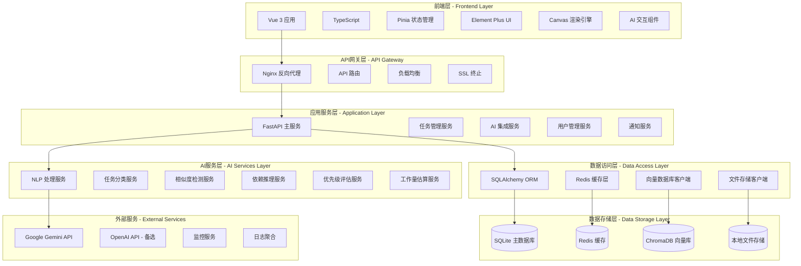

# TaskWall v3.0 技术架构设计文档

## 文档信息
- **版本**: v3.0
- **文档类型**: 技术架构设计
- **创建日期**: 2025-06-21
- **关联文档**: PRD-v3.0-Master.md, PRD-v3.0-AI-Features.md

---

## 1. 系统架构概览

### 1.1 整体架构图



### 1.2 技术栈选择

#### 1.2.1 前端技术栈
```yaml
核心框架:
  - Vue 3.4+: 组合式API，更好的TypeScript支持
  - TypeScript 5.0+: 类型安全，开发效率提升
  - Vite 5.0+: 快速构建，热重载

状态管理:
  - Pinia: Vue 3 官方推荐，类型安全

UI框架:
  - Element Plus: 成熟的Vue 3组件库
  - 自定义组件: 任务卡片、连线渲染等

构建工具:
  - Vite: 开发服务器和构建工具
  - ESLint + Prettier: 代码规范
  - Vitest: 单元测试框架
```

#### 1.2.2 后端技术栈
```yaml
Web框架:
  - FastAPI: 高性能，自动API文档，异步支持
  - Uvicorn: ASGI服务器

数据库:
  - SQLite: 主数据库，简单部署
  - SQLAlchemy: ORM框架
  - Alembic: 数据库迁移

AI/ML:
  - Google Gemini API: 主要NLP服务
  - sentence-transformers: 本地向量化
  - scikit-learn: 机器学习算法
  - ChromaDB: 向量数据库

缓存:
  - Redis: 缓存，会话存储

部署:
  - Docker: 容器化部署
  - Docker Compose: 多服务编排
```

---

## 2. 数据库设计

### 2.1 数据模型设计

#### 2.1.1 核心数据模型
```python
from sqlmodel import SQLModel, Field, Relationship
from datetime import datetime
from typing import Optional, List
from enum import Enum

class PriorityLevel(int, Enum):
    CRITICAL = 0    # 紧急
    HIGH = 1        # 高
    MEDIUM = 2      # 中
    LOW = 3         # 低
    BACKLOG = 4     # 待办

class TaskStatus(str, Enum):
    TODO = "todo"
    IN_PROGRESS = "in_progress"
    DONE = "done"
    ARCHIVED = "archived"

class DependencyType(str, Enum):
    BLOCKS = "blocks"           # 阻塞关系
    ENABLES = "enables"         # 启用关系
    RELATES = "relates"         # 相关关系
    SUBTASK = "subtask"         # 子任务关系
    RESOURCE_SHARED = "shared"  # 资源共享

# 任务表
class Task(SQLModel, table=True):
    id: Optional[int] = Field(default=None, primary_key=True)
    title: str = Field(max_length=200, index=True)
    description: str = Field(default="")
    priority: PriorityLevel = Field(default=PriorityLevel.MEDIUM)
    status: TaskStatus = Field(default=TaskStatus.TODO)
    
    # 分类信息
    module_id: Optional[int] = Field(foreign_key="module.id")
    category: Optional[str] = Field(max_length=50)
    tags: Optional[str] = Field(default="")  # JSON字符串存储标签
    
    # 层次结构
    parent_id: Optional[int] = Field(foreign_key="task.id")
    
    # 时间信息
    created_at: datetime = Field(default_factory=datetime.utcnow)
    updated_at: datetime = Field(default_factory=datetime.utcnow)
    deadline: Optional[datetime] = None
    started_at: Optional[datetime] = None
    completed_at: Optional[datetime] = None
    
    # 工作量估算
    estimated_hours: float = Field(default=0.0)
    actual_hours: float = Field(default=0.0)
    
    # 位置信息（画布坐标）
    position_x: float = Field(default=0.0)
    position_y: float = Field(default=0.0)
    
    # AI相关字段
    ai_generated: bool = Field(default=False)
    ai_confidence: float = Field(default=0.0)
    ai_reasoning: Optional[str] = None
    
    # 关联关系
    module: Optional["Module"] = Relationship(back_populates="tasks")
    parent: Optional["Task"] = Relationship(back_populates="children", sa_relationship_kwargs={"remote_side": "Task.id"})
    children: List["Task"] = Relationship(back_populates="parent")
    history: List["TaskHistory"] = Relationship(back_populates="task")
    
    # 依赖关系
    depends_on: List["TaskDependency"] = Relationship(back_populates="from_task", sa_relationship_kwargs={"foreign_keys": "TaskDependency.from_task_id"})
    dependents: List["TaskDependency"] = Relationship(back_populates="to_task", sa_relationship_kwargs={"foreign_keys": "TaskDependency.to_task_id"})

# 模块表
class Module(SQLModel, table=True):
    id: Optional[int] = Field(default=None, primary_key=True)
    name: str = Field(max_length=100, unique=True)
    description: str = Field(default="")
    color: str = Field(max_length=7, default="#3B82F6")  # 十六进制颜色
    icon: str = Field(max_length=10, default="📁")
    
    created_at: datetime = Field(default_factory=datetime.utcnow)
    updated_at: datetime = Field(default_factory=datetime.utcnow)
    
    # 关联关系
    tasks: List[Task] = Relationship(back_populates="module")

# 任务依赖关系表
class TaskDependency(SQLModel, table=True):
    id: Optional[int] = Field(default=None, primary_key=True)
    from_task_id: int = Field(foreign_key="task.id")
    to_task_id: int = Field(foreign_key="task.id")
    dependency_type: DependencyType = Field(default=DependencyType.BLOCKS)
    
    # AI推理相关
    ai_inferred: bool = Field(default=False)
    confidence: float = Field(default=1.0)
    reasoning: Optional[str] = None
    
    created_at: datetime = Field(default_factory=datetime.utcnow)
    
    # 关联关系
    from_task: Task = Relationship(back_populates="depends_on", sa_relationship_kwargs={"foreign_keys": "TaskDependency.from_task_id"})
    to_task: Task = Relationship(back_populates="dependents", sa_relationship_kwargs={"foreign_keys": "TaskDependency.to_task_id"})

# 任务历史记录表
class TaskHistory(SQLModel, table=True):
    id: Optional[int] = Field(default=None, primary_key=True)
    task_id: int = Field(foreign_key="task.id")
    field: str = Field(max_length=50)  # 变更的字段名
    old_value: Optional[str] = None
    new_value: Optional[str] = None
    change_type: str = Field(max_length=20)  # create, update, delete
    
    # 变更来源
    source: str = Field(default="user")  # user, ai, system
    user_id: Optional[str] = None
    
    created_at: datetime = Field(default_factory=datetime.utcnow)
    
    # 关联关系
    task: Task = Relationship(back_populates="history")

# AI任务向量表（用于相似度检测）
class TaskVector(SQLModel, table=True):
    id: Optional[int] = Field(default=None, primary_key=True)
    task_id: int = Field(foreign_key="task.id", unique=True)
    vector_id: str = Field(max_length=100)  # ChromaDB中的向量ID
    last_updated: datetime = Field(default_factory=datetime.utcnow)

# 用户反馈表
class AIFeedback(SQLModel, table=True):
    id: Optional[int] = Field(default=None, primary_key=True)
    operation: str = Field(max_length=50)  # 操作类型：parse, classify, etc.
    input_hash: str = Field(max_length=64)  # 输入数据的哈希
    ai_result: str = Field()  # AI结果的JSON
    user_correction: Optional[str] = None  # 用户修正的JSON
    feedback_type: str = Field(max_length=20)  # accept, reject, modify
    
    created_at: datetime = Field(default_factory=datetime.utcnow)
```

#### 2.1.2 数据库索引优化
```sql
-- 性能优化索引
CREATE INDEX idx_task_status_priority ON task(status, priority);
CREATE INDEX idx_task_module_created ON task(module_id, created_at);
CREATE INDEX idx_task_deadline ON task(deadline) WHERE deadline IS NOT NULL;
CREATE INDEX idx_task_parent ON task(parent_id) WHERE parent_id IS NOT NULL;

-- 依赖关系查询优化
CREATE INDEX idx_dependency_from ON taskdependency(from_task_id);
CREATE INDEX idx_dependency_to ON taskdependency(to_task_id);

-- 历史记录查询优化
CREATE INDEX idx_history_task_time ON taskhistory(task_id, created_at);

-- 全文搜索索引
CREATE VIRTUAL TABLE task_fts USING fts5(
    title, description, content=task, 
    tokenize = 'porter unicode61'
);
```

### 2.2 向量数据库设计

#### 2.2.1 ChromaDB集合设计
```python
import chromadb
from chromadb.config import Settings

class VectorDBManager:
    def __init__(self):
        self.client = chromadb.Client(Settings(
            chroma_db_impl="duckdb+parquet",
            persist_directory="./data/chroma"
        ))
        
        # 任务向量集合
        self.task_collection = self.client.get_or_create_collection(
            name="task_vectors",
            metadata={
                "description": "Task content vectors for similarity search",
                "version": "1.0"
            }
        )
        
        # 分类向量集合
        self.category_collection = self.client.get_or_create_collection(
            name="category_vectors", 
            metadata={
                "description": "Category vectors for classification",
                "version": "1.0"
            }
        )
    
    def add_task_vector(self, task_id: int, content: str, metadata: dict):
        """添加任务向量"""
        from sentence_transformers import SentenceTransformer
        
        model = SentenceTransformer('paraphrase-multilingual-MiniLM-L12-v2')
        embedding = model.encode(content).tolist()
        
        self.task_collection.add(
            ids=[f"task_{task_id}"],
            embeddings=[embedding],
            documents=[content],
            metadatas=[{
                "task_id": task_id,
                "title": metadata.get("title", ""),
                "category": metadata.get("category", ""),
                "priority": metadata.get("priority", 2),
                "created_at": metadata.get("created_at", "")
            }]
        )
    
    def find_similar_tasks(self, content: str, n_results: int = 5, threshold: float = 0.8):
        """查找相似任务"""
        from sentence_transformers import SentenceTransformer
        
        model = SentenceTransformer('paraphrase-multilingual-MiniLM-L12-v2')
        query_embedding = model.encode(content).tolist()
        
        results = self.task_collection.query(
            query_embeddings=[query_embedding],
            n_results=n_results,
            include=["documents", "metadatas", "distances"]
        )
        
        # 过滤低相似度结果
        filtered_results = []
        for i, distance in enumerate(results["distances"][0]):
            similarity = 1 - distance  # ChromaDB使用距离，转换为相似度
            if similarity >= threshold:
                filtered_results.append({
                    "task_id": results["metadatas"][0][i]["task_id"],
                    "similarity": similarity,
                    "content": results["documents"][0][i],
                    "metadata": results["metadatas"][0][i]
                })
        
        return filtered_results
```

---

## 3. API设计

### 3.1 RESTful API设计

#### 3.1.1 API路由结构
```python
from fastapi import FastAPI, APIRouter
from fastapi.middleware.cors import CORSMiddleware

app = FastAPI(
    title="TaskWall API",
    description="AI-powered task management system",
    version="3.0.0"
)

# CORS配置
app.add_middleware(
    CORSMiddleware,
    allow_origins=["http://localhost:3000"],
    allow_credentials=True,
    allow_methods=["*"],
    allow_headers=["*"],
)

# 路由模块
api_router = APIRouter(prefix="/api")

# 任务管理路由
tasks_router = APIRouter(prefix="/tasks", tags=["tasks"])
modules_router = APIRouter(prefix="/modules", tags=["modules"])
dependencies_router = APIRouter(prefix="/dependencies", tags=["dependencies"])

# AI功能路由
ai_router = APIRouter(prefix="/ai", tags=["ai"])
nlp_router = APIRouter(prefix="/nlp", tags=["nlp"])
analysis_router = APIRouter(prefix="/analysis", tags=["analysis"])

# 包含路由
api_router.include_router(tasks_router)
api_router.include_router(modules_router)
api_router.include_router(dependencies_router)
api_router.include_router(ai_router)
api_router.include_router(nlp_router)
api_router.include_router(analysis_router)

app.include_router(api_router)
```

#### 3.1.2 核心API端点设计
```python
from pydantic import BaseModel
from typing import List, Optional
from datetime import datetime

# 请求/响应模型
class TaskCreateRequest(BaseModel):
    title: str
    description: Optional[str] = ""
    priority: Optional[int] = 2
    module_id: Optional[int] = None
    parent_id: Optional[int] = None
    deadline: Optional[datetime] = None
    estimated_hours: Optional[float] = 0.0
    position_x: Optional[float] = 0.0
    position_y: Optional[float] = 0.0

class TaskResponse(BaseModel):
    id: int
    title: str
    description: str
    priority: int
    status: str
    module_id: Optional[int]
    parent_id: Optional[int]
    created_at: datetime
    updated_at: datetime
    deadline: Optional[datetime]
    estimated_hours: float
    actual_hours: float
    position_x: float
    position_y: float
    ai_confidence: float

# AI相关请求模型
class NLPParseRequest(BaseModel):
    text: str
    context: Optional[dict] = None

class NLPParseResponse(BaseModel):
    tasks: List[dict]
    confidence: float
    reasoning: List[str]

class TaskClassificationRequest(BaseModel):
    task_ids: List[int]
    user_context: Optional[dict] = None

class SimilaritySearchRequest(BaseModel):
    task_id: int
    threshold: Optional[float] = 0.8
    max_results: Optional[int] = 5

# API端点实现
@tasks_router.post("/", response_model=TaskResponse)
async def create_task(task: TaskCreateRequest, db: Session = Depends(get_db)):
    """创建新任务"""
    db_task = Task(**task.dict())
    db.add(db_task)
    db.commit()
    db.refresh(db_task)
    
    # 异步处理AI增强
    background_tasks.add_task(enhance_task_with_ai, db_task.id)
    
    return db_task

@tasks_router.get("/", response_model=List[TaskResponse])
async def list_tasks(
    skip: int = 0,
    limit: int = 100,
    status: Optional[str] = None,
    module_id: Optional[int] = None,
    db: Session = Depends(get_db)
):
    """获取任务列表"""
    query = db.query(Task)
    
    if status:
        query = query.filter(Task.status == status)
    if module_id:
        query = query.filter(Task.module_id == module_id)
    
    tasks = query.offset(skip).limit(limit).all()
    return tasks

@ai_router.post("/parse", response_model=NLPParseResponse)
async def parse_natural_language(
    request: NLPParseRequest,
    ai_service: AIService = Depends(get_ai_service)
):
    """自然语言任务解析"""
    try:
        result = await ai_service.parse_tasks_from_text(
            text=request.text,
            context=request.context
        )
        return result
    except Exception as e:
        raise HTTPException(status_code=500, detail=str(e))

@ai_router.post("/classify", response_model=List[dict])
async def classify_tasks(
    request: TaskClassificationRequest,
    ai_service: AIService = Depends(get_ai_service)
):
    """任务智能分类"""
    try:
        result = await ai_service.classify_tasks(
            task_ids=request.task_ids,
            user_context=request.user_context
        )
        return result
    except Exception as e:
        raise HTTPException(status_code=500, detail=str(e))

@ai_router.post("/similar", response_model=List[dict])
async def find_similar_tasks(
    request: SimilaritySearchRequest,
    ai_service: AIService = Depends(get_ai_service)
):
    """查找相似任务"""
    try:
        result = await ai_service.find_similar_tasks(
            task_id=request.task_id,
            threshold=request.threshold,
            max_results=request.max_results
        )
        return result
    except Exception as e:
        raise HTTPException(status_code=500, detail=str(e))
```

### 3.2 WebSocket实时通信

#### 3.2.1 WebSocket连接管理
```python
from fastapi import WebSocket, WebSocketDisconnect
import json
import asyncio

class ConnectionManager:
    def __init__(self):
        self.active_connections: List[WebSocket] = []
        self.user_connections: dict = {}
    
    async def connect(self, websocket: WebSocket, user_id: str):
        await websocket.accept()
        self.active_connections.append(websocket)
        self.user_connections[user_id] = websocket
    
    def disconnect(self, websocket: WebSocket, user_id: str):
        self.active_connections.remove(websocket)
        if user_id in self.user_connections:
            del self.user_connections[user_id]
    
    async def send_personal_message(self, message: str, user_id: str):
        if user_id in self.user_connections:
            await self.user_connections[user_id].send_text(message)
    
    async def broadcast(self, message: str):
        for connection in self.active_connections:
            await connection.send_text(message)

manager = ConnectionManager()

@app.websocket("/ws/{user_id}")
async def websocket_endpoint(websocket: WebSocket, user_id: str):
    await manager.connect(websocket, user_id)
    try:
        while True:
            data = await websocket.receive_text()
            message = json.loads(data)
            
            # 处理不同类型的消息
            if message["type"] == "task_update":
                await handle_task_update(message, user_id)
            elif message["type"] == "ai_request":
                await handle_ai_request(message, user_id)
            
    except WebSocketDisconnect:
        manager.disconnect(websocket, user_id)

async def handle_ai_request(message: dict, user_id: str):
    """处理AI请求"""
    try:
        # 处理AI请求
        result = await process_ai_request(message)
        
        # 发送结果给用户
        response = {
            "type": "ai_response",
            "request_id": message.get("request_id"),
            "result": result
        }
        await manager.send_personal_message(json.dumps(response), user_id)
        
    except Exception as e:
        error_response = {
            "type": "ai_error",
            "request_id": message.get("request_id"),
            "error": str(e)
        }
        await manager.send_personal_message(json.dumps(error_response), user_id)
```

---

## 4. AI服务架构

### 4.1 AI服务模块设计

#### 4.1.1 AI服务基础架构
```python
from abc import ABC, abstractmethod
from typing import Dict, List, Any, Optional
import asyncio
from datetime import datetime

class AIServiceBase(ABC):
    """AI服务基类"""
    
    def __init__(self):
        self.cache = AIResultCache()
        self.monitor = AIMonitor()
    
    @abstractmethod
    async def process(self, input_data: Dict[str, Any]) -> Dict[str, Any]:
        """处理AI请求的抽象方法"""
        pass
    
    async def process_with_cache(self, input_data: Dict[str, Any]) -> Dict[str, Any]:
        """带缓存的处理方法"""
        # 1. 生成输入哈希
        input_hash = self._generate_input_hash(input_data)
        
        # 2. 检查缓存
        cached_result = await self.cache.get_cached_result(
            operation=self.__class__.__name__,
            input_hash=input_hash
        )
        
        if cached_result:
            return cached_result
        
        # 3. 执行AI处理
        start_time = datetime.now()
        try:
            result = await self.process(input_data)
            execution_time = (datetime.now() - start_time).total_seconds()
            
            # 4. 缓存结果
            await self.cache.cache_result(
                operation=self.__class__.__name__,
                input_hash=input_hash,
                result=result
            )
            
            # 5. 记录监控指标
            self.monitor.track_ai_operation(
                operation=self.__class__.__name__,
                input_data=input_data,
                result=result,
                execution_time=execution_time
            )
            
            return result
            
        except Exception as e:
            execution_time = (datetime.now() - start_time).total_seconds()
            self.monitor.track_ai_error(
                operation=self.__class__.__name__,
                input_data=input_data,
                error=str(e),
                execution_time=execution_time
            )
            raise

class NLPParsingService(AIServiceBase):
    """自然语言解析服务"""
    
    def __init__(self):
        super().__init__()
        self.gemini_client = GeminiClient()
        self.parser = TaskNLPParser()
    
    async def process(self, input_data: Dict[str, Any]) -> Dict[str, Any]:
        text = input_data["text"]
        context = input_data.get("context", {})
        
        # 1. 预处理文本
        cleaned_text = self.parser.preprocess_text(text)
        
        # 2. 调用Gemini API解析
        parsing_result = await self.gemini_client.parse_tasks(
            text=cleaned_text,
            context=context
        )
        
        # 3. 后处理和验证
        validated_tasks = self.parser.validate_parsed_tasks(parsing_result["tasks"])
        
        return {
            "tasks": validated_tasks,
            "confidence": parsing_result["confidence"],
            "reasoning": parsing_result["reasoning"]
        }

class TaskClassificationService(AIServiceBase):
    """任务分类服务"""
    
    def __init__(self):
        super().__init__()
        self.classifier = TaskClassifier()
        self.vector_db = VectorDBManager()
    
    async def process(self, input_data: Dict[str, Any]) -> Dict[str, Any]:
        task_ids = input_data["task_ids"]
        user_context = input_data.get("user_context", {})
        
        results = []
        for task_id in task_ids:
            # 1. 获取任务数据
            task = await self._get_task(task_id)
            
            # 2. 执行分类
            classification = await self.classifier.classify_task(task, user_context)
            
            # 3. 更新向量数据库
            await self.vector_db.update_task_vector(task_id, task, classification)
            
            results.append({
                "task_id": task_id,
                "classification": classification
            })
        
        return {"results": results}

class SimilarityDetectionService(AIServiceBase):
    """相似度检测服务"""
    
    def __init__(self):
        super().__init__()
        self.vector_db = VectorDBManager()
        self.similarity_analyzer = SimilarityAnalyzer()
    
    async def process(self, input_data: Dict[str, Any]) -> Dict[str, Any]:
        task_id = input_data["task_id"]
        threshold = input_data.get("threshold", 0.8)
        max_results = input_data.get("max_results", 5)
        
        # 1. 获取任务内容
        task = await self._get_task(task_id)
        task_content = f"{task.title} {task.description}"
        
        # 2. 向量搜索
        similar_tasks = await self.vector_db.find_similar_tasks(
            content=task_content,
            n_results=max_results,
            threshold=threshold
        )
        
        # 3. 详细相似度分析
        detailed_similarities = []
        for similar_task in similar_tasks:
            detailed_sim = await self.similarity_analyzer.analyze_detailed_similarity(
                task, similar_task
            )
            detailed_similarities.append(detailed_sim)
        
        return {"similar_tasks": detailed_similarities}
```

#### 4.1.2 AI服务聚合器
```python
class AIServiceAggregator:
    """AI服务聚合器，协调多个AI服务"""
    
    def __init__(self):
        self.nlp_service = NLPParsingService()
        self.classification_service = TaskClassificationService()
        self.similarity_service = SimilarityDetectionService()
        self.priority_service = PriorityEstimationService()
        self.dependency_service = DependencyInferenceService()
    
    async def process_new_task_ai_pipeline(self, task_data: dict) -> dict:
        """新任务的AI处理流水线"""
        try:
            # 1. 如果是自然语言输入，先解析
            if task_data.get("is_natural_language"):
                parse_result = await self.nlp_service.process_with_cache({
                    "text": task_data["raw_text"],
                    "context": task_data.get("context", {})
                })
                task_data.update(parse_result["tasks"][0])
            
            # 2. 任务分类
            classification_result = await self.classification_service.process_with_cache({
                "task_data": task_data,
                "user_context": task_data.get("user_context", {})
            })
            
            # 3. 相似度检测（查找重复任务）
            if task_data.get("check_duplicates", True):
                similarity_result = await self.similarity_service.process_with_cache({
                    "task_content": f"{task_data['title']} {task_data.get('description', '')}",
                    "threshold": 0.85
                })
            
            # 4. 优先级评估
            priority_result = await self.priority_service.process_with_cache({
                "task_data": task_data,
                "context": task_data.get("context", {})
            })
            
            # 5. 依赖关系推理（如果有其他任务）
            if task_data.get("infer_dependencies", True):
                dependency_result = await self.dependency_service.process_with_cache({
                    "new_task": task_data,
                    "existing_tasks": task_data.get("existing_tasks", [])
                })
            
            # 6. 聚合结果
            ai_enhancement = {
                "classification": classification_result,
                "similar_tasks": similarity_result.get("similar_tasks", []),
                "priority_suggestion": priority_result,
                "suggested_dependencies": dependency_result.get("dependencies", []),
                "ai_confidence": self._calculate_overall_confidence([
                    classification_result.get("confidence", 0),
                    priority_result.get("confidence", 0)
                ])
            }
            
            return ai_enhancement
            
        except Exception as e:
            # AI增强失败不应该阻止任务创建
            print(f"AI pipeline error: {e}")
            return {"error": str(e), "ai_confidence": 0.0}
    
    def _calculate_overall_confidence(self, confidences: List[float]) -> float:
        """计算整体置信度"""
        if not confidences:
            return 0.0
        return sum(confidences) / len(confidences)
```

### 4.2 外部AI服务集成

#### 4.2.1 Google Gemini API集成
```python
import google.generativeai as genai
from typing import Dict, List, Any
import json
import asyncio

class GeminiClient:
    """Google Gemini API客户端"""
    
    def __init__(self):
        genai.configure(api_key=settings.GEMINI_API_KEY)
        self.model = genai.GenerativeModel('gemini-pro')
        
        # 任务解析的提示模板
        self.task_parsing_prompt = """
        请分析以下文本，提取其中的任务信息。返回JSON格式的任务列表。

        文本: {text}

        每个任务应包含以下字段:
        - title: 任务标题 (必需)
        - description: 详细描述 (可选)
        - priority: 优先级 0-4 (0=紧急, 1=高, 2=中, 3=低, 4=待办)
        - deadline: 截止时间 (ISO格式，可选)
        - estimated_hours: 预估工时 (数字，可选)
        - tags: 标签列表 (可选)

        请确保:
        1. 准确识别任务边界
        2. 从上下文推断优先级
        3. 识别时间表达式
        4. 提取关键标签

        返回格式:
        {
            "tasks": [...],
            "confidence": 0.85,
            "reasoning": ["解析依据1", "解析依据2"]
        }
        """
    
    async def parse_tasks(self, text: str, context: dict = None) -> dict:
        """解析任务文本"""
        try:
            # 构建提示
            prompt = self.task_parsing_prompt.format(text=text)
            if context:
                prompt += f"\n\n上下文信息: {json.dumps(context, ensure_ascii=False)}"
            
            # 调用Gemini API
            response = await asyncio.to_thread(
                self.model.generate_content, prompt
            )
            
            # 解析响应
            result_text = response.text
            
            # 尝试解析JSON
            try:
                result = json.loads(result_text)
            except json.JSONDecodeError:
                # 如果不是标准JSON，尝试提取JSON部分
                result = self._extract_json_from_text(result_text)
            
            return self._validate_parsing_result(result)
            
        except Exception as e:
            print(f"Gemini API error: {e}")
            return {
                "tasks": [],
                "confidence": 0.0,
                "reasoning": [f"API调用失败: {str(e)}"]
            }
    
    def _extract_json_from_text(self, text: str) -> dict:
        """从文本中提取JSON"""
        import re
        
        # 查找JSON块
        json_pattern = r'```json\s*(\{.*?\})\s*```'
        match = re.search(json_pattern, text, re.DOTALL)
        
        if match:
            try:
                return json.loads(match.group(1))
            except json.JSONDecodeError:
                pass
        
        # 查找普通的JSON对象
        json_pattern = r'(\{.*\})'
        match = re.search(json_pattern, text, re.DOTALL)
        
        if match:
            try:
                return json.loads(match.group(1))
            except json.JSONDecodeError:
                pass
        
        # 解析失败，返回默认结构
        return {
            "tasks": [],
            "confidence": 0.0,
            "reasoning": ["无法解析Gemini响应中的JSON"]
        }
    
    def _validate_parsing_result(self, result: dict) -> dict:
        """验证解析结果"""
        if not isinstance(result, dict):
            return {"tasks": [], "confidence": 0.0, "reasoning": ["结果格式错误"]}
        
        # 确保必需字段存在
        if "tasks" not in result:
            result["tasks"] = []
        
        if "confidence" not in result:
            result["confidence"] = 0.5
        
        if "reasoning" not in result:
            result["reasoning"] = ["自动生成的解析结果"]
        
        # 验证每个任务
        validated_tasks = []
        for task in result["tasks"]:
            if isinstance(task, dict) and "title" in task:
                # 确保优先级在有效范围内
                if "priority" in task:
                    task["priority"] = max(0, min(4, int(task.get("priority", 2))))
                else:
                    task["priority"] = 2
                
                validated_tasks.append(task)
        
        result["tasks"] = validated_tasks
        return result
```

#### 4.2.2 备选AI服务（OpenAI）
```python
import openai
from typing import Dict, List, Any

class OpenAIClient:
    """OpenAI API客户端（备选方案）"""
    
    def __init__(self):
        openai.api_key = settings.OPENAI_API_KEY
        self.model = "gpt-4"
    
    async def parse_tasks(self, text: str, context: dict = None) -> dict:
        """使用OpenAI GPT-4解析任务"""
        try:
            system_prompt = """
            你是一个任务管理助手。请分析用户输入的文本，提取其中的任务信息。
            
            返回格式要求：
            - 严格按照JSON格式返回
            - 包含tasks数组、confidence分数和reasoning数组
            - 每个任务必须有title字段
            - 优先级范围0-4（0=紧急，4=待办）
            """
            
            user_prompt = f"请分析以下文本并提取任务：\n\n{text}"
            if context:
                user_prompt += f"\n\n上下文：{json.dumps(context, ensure_ascii=False)}"
            
            response = await openai.ChatCompletion.acreate(
                model=self.model,
                messages=[
                    {"role": "system", "content": system_prompt},
                    {"role": "user", "content": user_prompt}
                ],
                temperature=0.3,
                max_tokens=2000
            )
            
            result_text = response.choices[0].message.content
            result = json.loads(result_text)
            
            return self._validate_parsing_result(result)
            
        except Exception as e:
            print(f"OpenAI API error: {e}")
            return {
                "tasks": [],
                "confidence": 0.0,
                "reasoning": [f"OpenAI API调用失败: {str(e)}"]
            }
```

---

## 5. 性能优化策略

### 5.1 前端性能优化

#### 5.1.1 组件懒加载
```typescript
// 路由懒加载
const routes = [
  {
    path: '/',
    name: 'Home',
    component: () => import('@/pages/Home.vue')
  },
  {
    path: '/timeline',
    name: 'Timeline', 
    component: () => import('@/pages/Timeline.vue')
  },
  {
    path: '/analytics',
    name: 'Analytics',
    component: () => import('@/pages/Analytics.vue')
  }
]

// 组件懒加载
export default defineAsyncComponent({
  loader: () => import('./TaskCard.vue'),
  loadingComponent: TaskCardSkeleton,
  errorComponent: TaskCardError,
  delay: 200,
  timeout: 3000
})
```

#### 5.1.2 虚拟滚动
```vue
<template>
  <div class="virtual-list-container">
    <RecycleScroller
      class="scroller"
      :items="tasks"
      :item-size="120"
      key-field="id"
      v-slot="{ item }"
    >
      <TaskCard :task="item" />
    </RecycleScroller>
  </div>
</template>

<script setup lang="ts">
import { RecycleScroller } from 'vue-virtual-scroller'

const props = defineProps<{
  tasks: Task[]
}>()
</script>
```

#### 5.1.3 状态管理优化
```typescript
// Pinia状态优化
export const useTaskStore = defineStore('tasks', () => {
  const tasks = ref<Task[]>([])
  const tasksMap = computed(() => {
    const map = new Map<number, Task>()
    tasks.value.forEach(task => map.set(task.id, task))
    return map
  })
  
  // 使用Map提高查找性能
  const getTaskById = (id: number) => tasksMap.value.get(id)
  
  // 分页加载
  const loadTasks = async (page: number = 1, limit: number = 50) => {
    const response = await api.get(`/tasks?page=${page}&limit=${limit}`)
    
    if (page === 1) {
      tasks.value = response.data
    } else {
      tasks.value.push(...response.data)
    }
  }
  
  // 智能更新（避免重复渲染）
  const updateTask = (updatedTask: Task) => {
    const index = tasks.value.findIndex(t => t.id === updatedTask.id)
    if (index !== -1) {
      // 使用Object.assign避免响应式重新创建
      Object.assign(tasks.value[index], updatedTask)
    }
  }
  
  return {
    tasks: readonly(tasks),
    tasksMap,
    getTaskById,
    loadTasks,
    updateTask
  }
})
```

### 5.2 后端性能优化

#### 5.2.1 数据库查询优化
```python
from sqlalchemy.orm import selectinload, joinedload
from sqlalchemy import and_, or_

class TaskRepository:
    def __init__(self, db: Session):
        self.db = db
    
    async def get_tasks_with_relations(self, filters: dict = None) -> List[Task]:
        """优化的任务查询，预加载关联数据"""
        query = self.db.query(Task).options(
            selectinload(Task.module),
            selectinload(Task.children),
            selectinload(Task.depends_on).selectinload(TaskDependency.to_task),
            selectinload(Task.dependents).selectinload(TaskDependency.from_task)
        )
        
        # 动态构建过滤条件
        if filters:
            if filters.get('status'):
                query = query.filter(Task.status == filters['status'])
            if filters.get('module_id'):
                query = query.filter(Task.module_id == filters['module_id'])
            if filters.get('priority_range'):
                min_p, max_p = filters['priority_range']
                query = query.filter(and_(Task.priority >= min_p, Task.priority <= max_p))
        
        return query.all()
    
    async def search_tasks(self, search_term: str, limit: int = 20) -> List[Task]:
        """全文搜索优化"""
        # 使用FTS索引进行全文搜索
        fts_results = self.db.execute(text("""
            SELECT task.id FROM task_fts
            JOIN task ON task.id = task_fts.rowid
            WHERE task_fts MATCH :search_term
            LIMIT :limit
        """), {"search_term": search_term, "limit": limit})
        
        task_ids = [row[0] for row in fts_results]
        
        if not task_ids:
            return []
        
        # 批量加载匹配的任务
        return self.db.query(Task).filter(Task.id.in_(task_ids)).all()
```

#### 5.2.2 缓存策略
```python
from functools import wraps
import redis
import pickle
from typing import Any, Callable

class CacheManager:
    def __init__(self):
        self.redis_client = redis.Redis(
            host=settings.REDIS_HOST,
            port=settings.REDIS_PORT,
            db=settings.REDIS_DB
        )
    
    def cache_result(self, key_prefix: str, ttl: int = 3600):
        """缓存装饰器"""
        def decorator(func: Callable) -> Callable:
            @wraps(func)
            async def wrapper(*args, **kwargs) -> Any:
                # 生成缓存键
                cache_key = f"{key_prefix}:{hash(str(args) + str(kwargs))}"
                
                # 尝试从缓存获取
                cached_result = self.redis_client.get(cache_key)
                if cached_result:
                    return pickle.loads(cached_result)
                
                # 执行函数
                result = await func(*args, **kwargs)
                
                # 存储到缓存
                self.redis_client.setex(
                    cache_key, 
                    ttl, 
                    pickle.dumps(result)
                )
                
                return result
            return wrapper
        return decorator

cache_manager = CacheManager()

# 使用缓存
@cache_manager.cache_result("task_list", ttl=1800)
async def get_tasks_cached(filters: dict = None):
    return await TaskRepository(db).get_tasks_with_relations(filters)

@cache_manager.cache_result("ai_classification", ttl=3600)
async def classify_task_cached(task_content: str, context: dict):
    return await ai_service.classify_task(task_content, context)
```

#### 5.2.3 异步任务处理
```python
from celery import Celery
from typing import Dict, Any

# Celery配置
celery_app = Celery(
    'taskwall',
    broker='redis://localhost:6379/1',
    backend='redis://localhost:6379/1'
)

@celery_app.task
async def process_ai_enhancement(task_id: int, enhancement_type: str):
    """异步AI增强处理"""
    try:
        db = SessionLocal()
        task = db.query(Task).filter(Task.id == task_id).first()
        
        if not task:
            return {"error": "Task not found"}
        
        ai_service = AIServiceAggregator()
        
        if enhancement_type == "classification":
            result = await ai_service.classification_service.process_with_cache({
                "task_data": task.__dict__,
                "user_context": {}
            })
            
            # 更新任务分类
            task.category = result["classification"]["category"]
            task.ai_confidence = result["classification"]["confidence"]
            
        elif enhancement_type == "priority":
            result = await ai_service.priority_service.process_with_cache({
                "task_data": task.__dict__,
                "context": {}
            })
            
            # 更新优先级建议
            task.ai_suggested_priority = result["suggested_priority"]
            task.ai_confidence = result["confidence"]
        
        db.commit()
        return {"success": True, "task_id": task_id}
        
    except Exception as e:
        db.rollback()
        return {"error": str(e)}
    finally:
        db.close()

@celery_app.task
async def batch_similarity_update():
    """批量更新相似度索引"""
    try:
        db = SessionLocal()
        vector_db = VectorDBManager()
        
        # 获取需要更新的任务
        tasks_to_update = db.query(Task).filter(
            Task.updated_at > Task.last_vector_update
        ).all()
        
        # 批量更新向量
        for task in tasks_to_update:
            content = f"{task.title} {task.description}"
            await vector_db.update_task_vector(task.id, content, {
                "title": task.title,
                "category": task.category,
                "priority": task.priority
            })
            
            task.last_vector_update = datetime.utcnow()
        
        db.commit()
        return {"updated_count": len(tasks_to_update)}
        
    except Exception as e:
        db.rollback()
        return {"error": str(e)}
    finally:
        db.close()
```

---

## 6. 部署架构

### 6.1 Docker容器化

#### 6.1.1 Dockerfile设计
```dockerfile
# 前端Dockerfile
FROM node:18-alpine AS frontend-builder

WORKDIR /app
COPY frontend/package*.json ./
RUN npm ci --only=production

COPY frontend/ .
RUN npm run build

# 后端Dockerfile  
FROM python:3.11-slim AS backend

WORKDIR /app

# 安装系统依赖
RUN apt-get update && apt-get install -y \
    gcc \
    g++ \
    && rm -rf /var/lib/apt/lists/*

# 安装Python依赖
COPY backend/requirements.txt .
RUN pip install --no-cache-dir -r requirements.txt

# 复制应用代码
COPY backend/ .

# 创建数据目录
RUN mkdir -p /app/data /app/logs

# 设置环境变量
ENV PYTHONPATH=/app
ENV UVICORN_HOST=0.0.0.0
ENV UVICORN_PORT=8000

EXPOSE 8000

CMD ["uvicorn", "app.main:app", "--host", "0.0.0.0", "--port", "8000"]

# Nginx Dockerfile
FROM nginx:alpine AS frontend

COPY --from=frontend-builder /app/dist /usr/share/nginx/html
COPY nginx.conf /etc/nginx/nginx.conf

EXPOSE 80

CMD ["nginx", "-g", "daemon off;"]
```

#### 6.1.2 Docker Compose配置
```yaml
version: '3.8'

services:
  # 前端服务
  frontend:
    build:
      context: .
      dockerfile: Dockerfile.frontend
    ports:
      - "3000:80"
    depends_on:
      - backend
    environment:
      - API_BASE_URL=http://backend:8000
    networks:
      - taskwall-network

  # 后端服务
  backend:
    build:
      context: .
      dockerfile: Dockerfile.backend
    ports:
      - "8000:8000"
    depends_on:
      - redis
      - chromadb
    environment:
      - DATABASE_URL=sqlite:///./data/taskwall.db
      - REDIS_URL=redis://redis:6379/0
      - CHROMA_HOST=chromadb
      - CHROMA_PORT=8000
      - GEMINI_API_KEY=${GEMINI_API_KEY}
    volumes:
      - ./data:/app/data
      - ./logs:/app/logs
    networks:
      - taskwall-network

  # Redis缓存
  redis:
    image: redis:7-alpine
    ports:
      - "6379:6379"
    volumes:
      - redis-data:/data
    command: redis-server --appendonly yes
    networks:
      - taskwall-network

  # ChromaDB向量数据库
  chromadb:
    image: chromadb/chroma:latest
    ports:
      - "8001:8000"
    volumes:
      - chroma-data:/chroma/chroma
    environment:
      - CHROMA_SERVER_HOST=0.0.0.0
      - CHROMA_SERVER_HTTP_PORT=8000
    networks:
      - taskwall-network

  # Celery Worker (异步任务处理)
  celery-worker:
    build:
      context: .
      dockerfile: Dockerfile.backend
    command: celery -A app.celery worker --loglevel=info
    depends_on:
      - redis
      - backend
    environment:
      - DATABASE_URL=sqlite:///./data/taskwall.db
      - REDIS_URL=redis://redis:6379/1
      - GEMINI_API_KEY=${GEMINI_API_KEY}
    volumes:
      - ./data:/app/data
      - ./logs:/app/logs
    networks:
      - taskwall-network

  # Celery Beat (定时任务)
  celery-beat:
    build:
      context: .
      dockerfile: Dockerfile.backend
    command: celery -A app.celery beat --loglevel=info
    depends_on:
      - redis
      - backend
    environment:
      - DATABASE_URL=sqlite:///./data/taskwall.db
      - REDIS_URL=redis://redis:6379/1
    volumes:
      - ./data:/app/data
      - ./logs:/app/logs
    networks:
      - taskwall-network

volumes:
  redis-data:
  chroma-data:

networks:
  taskwall-network:
    driver: bridge
```

### 6.2 生产环境部署

#### 6.2.1 Kubernetes部署配置
```yaml
# namespace.yaml
apiVersion: v1
kind: Namespace
metadata:
  name: taskwall

---
# configmap.yaml
apiVersion: v1
kind: ConfigMap
metadata:
  name: taskwall-config
  namespace: taskwall
data:
  DATABASE_URL: "sqlite:///./data/taskwall.db"
  REDIS_URL: "redis://redis-service:6379/0"
  CHROMA_HOST: "chromadb-service"
  CHROMA_PORT: "8000"

---
# secret.yaml
apiVersion: v1
kind: Secret
metadata:
  name: taskwall-secrets
  namespace: taskwall
type: Opaque
data:
  GEMINI_API_KEY: <base64-encoded-api-key>

---
# backend-deployment.yaml
apiVersion: apps/v1
kind: Deployment
metadata:
  name: taskwall-backend
  namespace: taskwall
spec:
  replicas: 2
  selector:
    matchLabels:
      app: taskwall-backend
  template:
    metadata:
      labels:
        app: taskwall-backend
    spec:
      containers:
      - name: backend
        image: taskwall/backend:v3.0
        ports:
        - containerPort: 8000
        envFrom:
        - configMapRef:
            name: taskwall-config
        - secretRef:
            name: taskwall-secrets
        volumeMounts:
        - name: data-volume
          mountPath: /app/data
        resources:
          requests:
            memory: "512Mi"
            cpu: "250m"
          limits:
            memory: "1Gi"
            cpu: "500m"
      volumes:
      - name: data-volume
        persistentVolumeClaim:
          claimName: taskwall-data-pvc

---
# backend-service.yaml
apiVersion: v1
kind: Service
metadata:
  name: taskwall-backend-service
  namespace: taskwall
spec:
  selector:
    app: taskwall-backend
  ports:
    - protocol: TCP
      port: 8000
      targetPort: 8000
  type: ClusterIP

---
# ingress.yaml
apiVersion: networking.k8s.io/v1
kind: Ingress
metadata:
  name: taskwall-ingress
  namespace: taskwall
  annotations:
    nginx.ingress.kubernetes.io/rewrite-target: /
    cert-manager.io/cluster-issuer: "letsencrypt-prod"
spec:
  tls:
  - hosts:
    - taskwall.example.com
    secretName: taskwall-tls
  rules:
  - host: taskwall.example.com
    http:
      paths:
      - path: /api
        pathType: Prefix
        backend:
          service:
            name: taskwall-backend-service
            port:
              number: 8000
      - path: /
        pathType: Prefix
        backend:
          service:
            name: taskwall-frontend-service
            port:
              number: 80
```

---

## 7. 监控与日志

### 7.1 监控体系

#### 7.1.1 Prometheus指标收集
```python
from prometheus_client import Counter, Histogram, Gauge, start_http_server
import time

# 定义监控指标
request_count = Counter('taskwall_requests_total', 'Total requests', ['method', 'endpoint'])
request_duration = Histogram('taskwall_request_duration_seconds', 'Request duration')
ai_processing_time = Histogram('taskwall_ai_processing_seconds', 'AI processing time', ['operation'])
active_tasks = Gauge('taskwall_active_tasks', 'Number of active tasks')
ai_accuracy = Gauge('taskwall_ai_accuracy', 'AI operation accuracy', ['operation'])

class MetricsMiddleware:
    def __init__(self, app):
        self.app = app
    
    async def __call__(self, scope, receive, send):
        if scope["type"] == "http":
            method = scope["method"]
            path = scope["path"]
            
            start_time = time.time()
            
            # 增加请求计数
            request_count.labels(method=method, endpoint=path).inc()
            
            # 执行请求
            await self.app(scope, receive, send)
            
            # 记录请求耗时
            duration = time.time() - start_time
            request_duration.observe(duration)
        else:
            await self.app(scope, receive, send)

# AI服务监控
class AIMetricsCollector:
    @staticmethod
    def record_ai_operation(operation: str, duration: float, accuracy: float = None):
        ai_processing_time.labels(operation=operation).observe(duration)
        if accuracy is not None:
            ai_accuracy.labels(operation=operation).set(accuracy)
    
    @staticmethod
    def update_task_count(count: int):
        active_tasks.set(count)

# 启动指标服务器
start_http_server(8001)
```

#### 7.1.2 健康检查端点
```python
from fastapi import HTTPException
from sqlalchemy import text

@app.get("/health")
async def health_check():
    """健康检查端点"""
    health_status = {
        "status": "healthy",
        "timestamp": datetime.utcnow().isoformat(),
        "services": {}
    }
    
    try:
        # 检查数据库连接
        db = SessionLocal()
        db.execute(text("SELECT 1"))
        health_status["services"]["database"] = "healthy"
        db.close()
    except Exception as e:
        health_status["services"]["database"] = f"unhealthy: {str(e)}"
        health_status["status"] = "unhealthy"
    
    try:
        # 检查Redis连接
        redis_client = redis.Redis()
        redis_client.ping()
        health_status["services"]["redis"] = "healthy"
    except Exception as e:
        health_status["services"]["redis"] = f"unhealthy: {str(e)}"
        health_status["status"] = "unhealthy"
    
    try:
        # 检查ChromaDB连接
        chroma_client = chromadb.Client()
        chroma_client.heartbeat()
        health_status["services"]["chromadb"] = "healthy"
    except Exception as e:
        health_status["services"]["chromadb"] = f"unhealthy: {str(e)}"
        health_status["status"] = "unhealthy"
    
    if health_status["status"] == "unhealthy":
        raise HTTPException(status_code=503, detail=health_status)
    
    return health_status

@app.get("/metrics")
async def get_custom_metrics():
    """自定义指标端点"""
    db = SessionLocal()
    
    try:
        # 统计任务数量
        total_tasks = db.query(Task).count()
        active_tasks_count = db.query(Task).filter(Task.status != TaskStatus.DONE).count()
        
        # 统计AI使用情况
        ai_enhanced_tasks = db.query(Task).filter(Task.ai_confidence > 0).count()
        
        # 统计依赖关系
        total_dependencies = db.query(TaskDependency).count()
        ai_inferred_deps = db.query(TaskDependency).filter(TaskDependency.ai_inferred == True).count()
        
        return {
            "tasks": {
                "total": total_tasks,
                "active": active_tasks_count,
                "ai_enhanced": ai_enhanced_tasks
            },
            "dependencies": {
                "total": total_dependencies,
                "ai_inferred": ai_inferred_deps
            },
            "ai_usage": {
                "enhancement_rate": ai_enhanced_tasks / total_tasks if total_tasks > 0 else 0,
                "dependency_inference_rate": ai_inferred_deps / total_dependencies if total_dependencies > 0 else 0
            }
        }
    finally:
        db.close()
```

### 7.2 日志管理

#### 7.2.1 结构化日志配置
```python
import structlog
import logging.config

# 配置结构化日志
logging.config.dictConfig({
    "version": 1,
    "disable_existing_loggers": False,
    "formatters": {
        "json": {
            "()": structlog.stdlib.ProcessorFormatter,
            "processor": structlog.dev.ConsoleRenderer(colors=False),
        },
    },
    "handlers": {
        "console": {
            "class": "logging.StreamHandler",
            "formatter": "json",
            "stream": "ext://sys.stdout",
        },
        "file": {
            "class": "logging.handlers.RotatingFileHandler",
            "formatter": "json",
            "filename": "/app/logs/taskwall.log",
            "maxBytes": 10485760,  # 10MB
            "backupCount": 5,
        },
    },
    "loggers": {
        "": {
            "handlers": ["console", "file"],
            "level": "INFO",
        },
        "taskwall.ai": {
            "handlers": ["console", "file"],
            "level": "DEBUG",
            "propagate": False,
        },
    },
})

structlog.configure(
    processors=[
        structlog.stdlib.filter_by_level,
        structlog.stdlib.add_logger_name,
        structlog.stdlib.add_log_level,
        structlog.stdlib.PositionalArgumentsFormatter(),
        structlog.processors.TimeStamper(fmt="iso"),
        structlog.processors.StackInfoRenderer(),
        structlog.processors.format_exc_info,
        structlog.processors.UnicodeDecoder(),
        structlog.processors.JSONRenderer()
    ],
    context_class=dict,
    logger_factory=structlog.stdlib.LoggerFactory(),
    wrapper_class=structlog.stdlib.BoundLogger,
    cache_logger_on_first_use=True,
)

# 获取结构化日志器
logger = structlog.get_logger("taskwall.ai")

# 使用示例
logger.info("AI operation started", 
           operation="task_classification",
           task_id=123,
           user_id="user_456")

logger.error("AI operation failed",
            operation="dependency_inference", 
            error="API timeout",
            task_count=5,
            duration=30.5)
```

#### 7.2.2 日志聚合配置
```yaml
# Fluentd配置 (fluent.conf)
<source>
  @type forward
  port 24224
  bind 0.0.0.0
</source>

<filter taskwall.**>
  @type parser
  key_name log
  <parse>
    @type json
  </parse>
</filter>

<match taskwall.**>
  @type elasticsearch
  host elasticsearch
  port 9200
  index_name taskwall-logs
  type_name _doc
  logstash_format true
  logstash_prefix taskwall
  logstash_dateformat %Y.%m.%d
  include_tag_key true
  tag_key @log_name
  flush_interval 1s
</match>
```

---

## 8. 安全架构

### 8.1 认证与授权

#### 8.1.1 JWT令牌管理
```python
from fastapi import Depends, HTTPException, status
from fastapi.security import HTTPBearer, HTTPAuthorizationCredentials
import jwt
from datetime import datetime, timedelta

security = HTTPBearer()

class AuthManager:
    def __init__(self):
        self.secret_key = settings.JWT_SECRET_KEY
        self.algorithm = "HS256"
        self.access_token_expire = timedelta(hours=24)
        self.refresh_token_expire = timedelta(days=7)
    
    def create_access_token(self, user_id: str, permissions: List[str] = None) -> str:
        """创建访问令牌"""
        expire = datetime.utcnow() + self.access_token_expire
        payload = {
            "user_id": user_id,
            "permissions": permissions or [],
            "exp": expire,
            "type": "access"
        }
        return jwt.encode(payload, self.secret_key, algorithm=self.algorithm)
    
    def verify_token(self, token: str) -> dict:
        """验证令牌"""
        try:
            payload = jwt.decode(token, self.secret_key, algorithms=[self.algorithm])
            if payload.get("type") != "access":
                raise HTTPException(status_code=401, detail="Invalid token type")
            return payload
        except jwt.ExpiredSignatureError:
            raise HTTPException(status_code=401, detail="Token expired")
        except jwt.JWTError:
            raise HTTPException(status_code=401, detail="Invalid token")

auth_manager = AuthManager()

async def get_current_user(credentials: HTTPAuthorizationCredentials = Depends(security)) -> dict:
    """获取当前用户"""
    token = credentials.credentials
    payload = auth_manager.verify_token(token)
    return {
        "user_id": payload["user_id"],
        "permissions": payload["permissions"]
    }

def require_permission(permission: str):
    """权限检查装饰器"""
    def decorator(func):
        async def wrapper(*args, current_user: dict = Depends(get_current_user), **kwargs):
            if permission not in current_user["permissions"]:
                raise HTTPException(
                    status_code=403, 
                    detail=f"Permission required: {permission}"
                )
            return await func(*args, current_user=current_user, **kwargs)
        return wrapper
    return decorator
```

### 8.2 数据安全

#### 8.2.1 敏感数据加密
```python
from cryptography.fernet import Fernet
import base64
import hashlib

class DataEncryption:
    def __init__(self):
        # 从环境变量或配置文件获取加密密钥
        self.key = self._derive_key(settings.ENCRYPTION_SECRET)
        self.cipher = Fernet(self.key)
    
    def _derive_key(self, secret: str) -> bytes:
        """从密码派生加密密钥"""
        key = hashlib.pbkdf2_hmac('sha256', secret.encode(), b'salt', 100000)
        return base64.urlsafe_b64encode(key)
    
    def encrypt(self, data: str) -> str:
        """加密字符串"""
        if not data:
            return data
        encrypted_data = self.cipher.encrypt(data.encode())
        return base64.urlsafe_b64encode(encrypted_data).decode()
    
    def decrypt(self, encrypted_data: str) -> str:
        """解密字符串"""
        if not encrypted_data:
            return encrypted_data
        try:
            encrypted_bytes = base64.urlsafe_b64decode(encrypted_data.encode())
            decrypted_data = self.cipher.decrypt(encrypted_bytes)
            return decrypted_data.decode()
        except Exception:
            return ""  # 解密失败返回空字符串

# 在数据模型中使用加密
from sqlalchemy_utils import EncryptedType
from sqlalchemy_utils.types.encrypted.encrypted_type import AesEngine

class SensitiveTask(SQLModel, table=True):
    id: Optional[int] = Field(default=None, primary_key=True)
    title: str
    # 敏感描述字段加密存储
    encrypted_description: str = Field(sa_column=Column(EncryptedType(String, settings.ENCRYPTION_SECRET, AesEngine, 'pkcs5')))
    
    @property
    def description(self) -> str:
        return self.encrypted_description
    
    @description.setter
    def description(self, value: str):
        self.encrypted_description = value
```

#### 8.2.2 API安全中间件
```python
from starlette.middleware.base import BaseHTTPMiddleware
from starlette.requests import Request
from starlette.responses import Response
import time

class SecurityMiddleware(BaseHTTPMiddleware):
    def __init__(self, app):
        super().__init__(app)
        self.rate_limiter = RateLimiter()
    
    async def dispatch(self, request: Request, call_next):
        # 1. 速率限制
        client_ip = self._get_client_ip(request)
        if not await self.rate_limiter.allow_request(client_ip):
            return Response(
                content="Too many requests",
                status_code=429
            )
        
        # 2. 安全头检查
        if not self._check_security_headers(request):
            return Response(
                content="Security headers required",
                status_code=400
            )
        
        # 3. 处理请求
        response = await call_next(request)
        
        # 4. 添加安全响应头
        self._add_security_headers(response)
        
        return response
    
    def _get_client_ip(self, request: Request) -> str:
        """获取客户端IP地址"""
        forwarded = request.headers.get("X-Forwarded-For")
        if forwarded:
            return forwarded.split(",")[0].strip()
        return request.client.host
    
    def _check_security_headers(self, request: Request) -> bool:
        """检查安全头"""
        # 检查CSRF令牌
        if request.method in ["POST", "PUT", "DELETE", "PATCH"]:
            csrf_token = request.headers.get("X-CSRF-Token")
            if not csrf_token:
                return False
        return True
    
    def _add_security_headers(self, response: Response):
        """添加安全响应头"""
        response.headers["X-Content-Type-Options"] = "nosniff"
        response.headers["X-Frame-Options"] = "DENY"
        response.headers["X-XSS-Protection"] = "1; mode=block"
        response.headers["Strict-Transport-Security"] = "max-age=31536000; includeSubDomains"
        response.headers["Content-Security-Policy"] = "default-src 'self'"

class RateLimiter:
    def __init__(self):
        self.redis_client = redis.Redis()
        self.max_requests = 100  # 每分钟最多100个请求
        self.window_size = 60    # 时间窗口60秒
    
    async def allow_request(self, client_ip: str) -> bool:
        """检查是否允许请求"""
        key = f"rate_limit:{client_ip}"
        current_time = int(time.time())
        window_start = current_time - self.window_size
        
        # 使用滑动窗口算法
        pipe = self.redis_client.pipeline()
        pipe.zremrangebyscore(key, 0, window_start)
        pipe.zcard(key)
        pipe.zadd(key, {str(current_time): current_time})
        pipe.expire(key, self.window_size)
        
        results = pipe.execute()
        current_requests = results[1]
        
        return current_requests < self.max_requests

# 应用中间件
app.add_middleware(SecurityMiddleware)
```

---

## 9. 总结

### 9.1 架构优势

1. **模块化设计**: 清晰的分层架构，便于维护和扩展
2. **AI驱动**: 深度集成AI功能，提供智能化任务管理
3. **高性能**: 多层缓存、异步处理、数据库优化
4. **可扩展**: 微服务架构，支持水平扩展
5. **安全可靠**: 完整的安全措施和监控体系

### 9.2 技术选型合理性

- **Vue 3 + TypeScript**: 现代前端技术栈，开发效率高
- **FastAPI**: 高性能异步Web框架，自动API文档
- **SQLite + ChromaDB**: 轻量级部署，向量搜索能力强
- **Redis**: 高性能缓存，支持多种数据结构
- **Docker**: 容器化部署，环境一致性

### 9.3 风险控制

- **AI依赖**: 多个AI服务提供商，降低单点故障风险
- **性能瓶颈**: 完善的缓存策略和异步处理
- **数据安全**: 多层次安全措施，加密存储
- **可用性**: 健康检查、监控告警、故障恢复

### 9.4 后续优化方向

1. **微服务拆分**: 随着业务增长，考虑进一步拆分服务
2. **机器学习优化**: 引入更先进的ML模型
3. **多租户支持**: 企业级多租户架构
4. **国际化**: 多语言和多地区支持

---

**文档维护**: 本技术架构文档将随着系统演进持续更新，确保架构设计与实际实现保持一致。